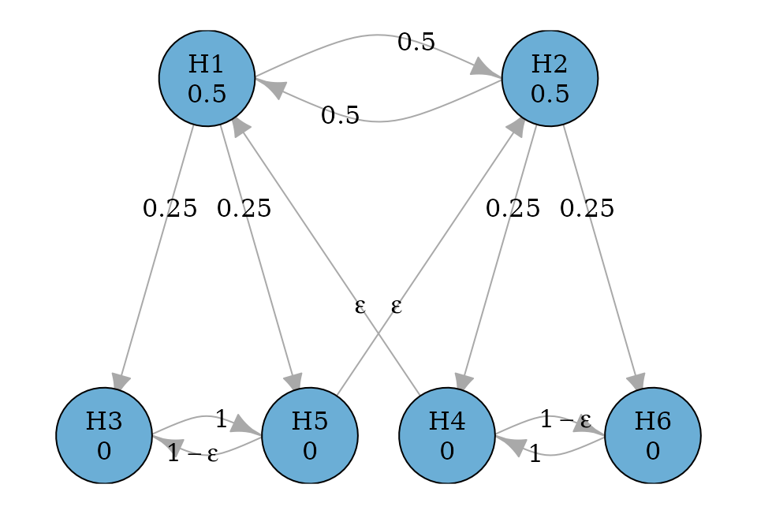

# Graphical multiple comparison procedures based on the closure principle

``` r
library(gt)
library(gMCP)
library(lrstat)
library(graphicalMCP)
```

## Motivating example

Consider a confirmatory clinical trial comparing a test treatment
(treatment) against the control treatment (control) for a disease. There
are two doses of treatment: the low dose and the high dose. There are
three endpoints included in the multiplicity adjustment strategy, which
are the primary endpoint (PE) and two secondary endpoints (SE1 and SE2).
In total, there are six null hypotheses: $H_{1}$, $H_{3}$ and $H_{5}$
are the primary hypothesis and two secondary hypotheses respectively for
the low dose versus control; $H_{2}$, $H_{4}$ and $H_{6}$ are the
primary hypothesis and two secondary hypotheses respectively for the
high dose versus control.

There are clinical considerations which constrain the structure of
multiple comparison procedures, and which can be flexibly incorporated
using graphical approaches. First, the low and the high doses are
considered equally important, which means that rejecting the primary
hypothesis for either dose versus control leads to a successful trial.
Regarding secondary hypotheses, each one is tested only if its
corresponding primary hypothesis has been rejected. This means that
$H_{3}$ and $H_{5}$ are tested only after $H_{1}$ has been rejected;
$H_{4}$ and $H_{6}$ are tested only after $H_{2}$ has been rejected.

In addition, there are some statistical considerations to complete the
graph. The primary hypotheses $H_{1}$ and $H_{2}$ will have an equal
hypothesis weight of 0.5. The secondary hypotheses have a hypothesis
weight of 0. When a primary hypothesis has been rejected, its weight
will propagate along three outgoing edges: one to the other primary
hypothesis and two to its descendant secondary hypotheses. The edge to
the other primary hypothesis will have a transition weight of 0.5; the
two edges to the descendant secondary hypotheses will have an equal
transition weight of 0.25. Between the secondary hypotheses for each
dose-control comparison, we will have an edge of a transition weight of
1 (or very close to 1 to allow $\epsilon$ edges). The hypothesis weights
for a dose-control comparison group will be propagated to the primary
hypothesis for the other dose-control comparison, but only after all
hypotheses in the first dose-control comparison group have been deleted.
With these specifications, we can create the following graph.

### Create a graph

``` r
hypotheses <- c(0.5, 0.5, 0, 0, 0, 0)

epsilon <- 1e-5
transitions <- rbind(
  c(0, 0.5, 0.25, 0, 0.25, 0),
  c(0.5, 0, 0, 0.25, 0, 0.25),
  c(0, 0, 0, 0, 1, 0),
  c(epsilon, 0, 0, 0, 0, 1 - epsilon),
  c(0, epsilon, 1 - epsilon, 0, 0, 0),
  c(0, 0, 0, 1, 0, 0)
)

hyp_names <- c("H1", "H2", "H3", "H4", "H5", "H6")
g <- graph_create(hypotheses, transitions, hyp_names)

plot_layout <- rbind(
  c(0.15, 0.5),
  c(0.65, 0.5),
  c(0, 0),
  c(0.5, 0),
  c(0.3, 0),
  c(0.8, 0)
)

plot(
  g,
  layout = plot_layout,
  eps = epsilon,
  edge_curves = c(pairs = 0.8),
  vertex.size = 35
)
```



## Perform the graphical multiple comparison procedure based on the closure principle

### Bonferroni tests

Given a set of p-values for $H_{1},\ldots,H_{6}$, the graphical multiple
comparison procedure can be performed to control the family-wise error
rate (FWER) at the significance level `alpha`. For one-sided p-values,
`alpha` is often set to 0.025 (default). First, we perform a
Bonferroni-based procedure using the closure principle (Bretz et al.
2009). After running the procedure, none of these hypotheses is
rejected. These results are identical to using
[`graph_test_shortcut()`](https://openpharma.github.io/graphicalMCP/reference/graph_test_shortcut.md).

``` r
p_values <- c(0.015, 0.013, 0.01, 0.007, 0.1, 0.0124)
test_results <- graph_test_closure(
  g,
  p = p_values,
  alpha = 0.025,
  verbose = TRUE,
  test_values = TRUE
)

test_results$outputs$adjusted_p
#>    H1    H2    H3    H4    H5    H6 
#> 0.026 0.026 0.028 0.028 0.100 0.028

test_results$outputs$rejected
#>    H1    H2    H3    H4    H5    H6 
#> FALSE FALSE FALSE FALSE FALSE FALSE
# Same testing results as
# 'graph_test_shortcut(g, p = p_values, alpha = 0.025)$outputs$rejected'
```

#### Obtain the closure

To investigate the closure and how every intersection hypothesis is
rejected, one could obtain the detailed output by specifying
`verbose = TRUE`. Because all hypotheses are tested using Bonferroni
tests, the adjusted p-value for every intersection hypothesis is the
same as the adjusted p-value for group 1 (meaning all hypotheses are in
the same group for Bonferroni tests). An intersection hypothesis is
rejected if its adjusted p-value is less than or equal to `alpha`.

Adjusted p-values are initially calculated by groups of hypotheses. In
this case there is only one group, which includes all hypotheses, but
there can be more. The adjusted p-value for an intersection hypothesis
is the minimum across groups within that intersection. Finally, the
adjusted p-value for an individual hypothesis for the whole procedure is
equal to the maximum of adjusted p-values across intersections involving
that hypothesis.

``` r
test_results_verbose <-
  graph_test_closure(
    g,
    p = p_values,
    alpha = 0.025,
    verbose = TRUE
  )

head(test_results_verbose$details$results)
#>   Intersection  H1  H2 H3 H4 H5 H6 adj_p_grp1 adj_p_inter reject_intersection
#> 1       111111 0.5 0.5  0  0  0  0      0.026       0.026               FALSE
#> 2       111110 0.5 0.5  0  0  0 NA      0.026       0.026               FALSE
#> 3       111101 0.5 0.5  0  0 NA  0      0.026       0.026               FALSE
#> 4       111100 0.5 0.5  0  0 NA NA      0.026       0.026               FALSE
#> 5       111011 0.5 0.5  0 NA  0  0      0.026       0.026               FALSE
#> 6       111010 0.5 0.5  0 NA  0 NA      0.026       0.026               FALSE
```

#### Obtain adjusted significance levels

An equivalent way to obtain rejections is via adjusting significance
levels. A hypothesis is rejected if its p-value is less than or equal to
its adjusted significance level. One can obtain adjusted significance
levels for every hypothesis in every intersection hypothesis in the
closure by specifying `test_values = TRUE`. A hypothesis is rejected by
the closed testing procedure if *all* intersection hypotheses involving
it have been rejected. An intersection hypothesis is rejected if *any*
null hypotheses within it have been rejected.

``` r
test_results_test_values <-
  graph_test_closure(
    g,
    test_types = "b",
    p = p_values,
    alpha = 0.025,
    test_values = TRUE
  )

head(test_results_test_values$test_values$results)
#>   Intersection Hypothesis       Test      p Weight Alpha Inequality_holds
#> 1       111111         H1 bonferroni 0.0150    0.5 0.025            FALSE
#> 2       111111         H2 bonferroni 0.0130    0.5 0.025            FALSE
#> 3       111111         H3 bonferroni 0.0100    0.0 0.025            FALSE
#> 4       111111         H4 bonferroni 0.0070    0.0 0.025            FALSE
#> 5       111111         H5 bonferroni 0.1000    0.0 0.025            FALSE
#> 6       111111         H6 bonferroni 0.0124    0.0 0.025            FALSE
```

### Mixed procedures for graphical approaches

The framework of graphicalMCP allows a mixture of tests to improve the
performance from the Bonferroni-based graphical approaches. We can group
hypotheses into multiple subgroups and perform a separate test for every
subgroup. Currently, graphicalMCP supports Bonferroni, parametric and
Simes tests. To connect results from different subgroups of hypotheses,
Bonferroni tests are used. Here, we will show two examples. The first
example applies parametric tests to primary hypotheses (Xi et al. 2017),
and the second example applies Simes tests to two subgroups of secondary
hypotheses in addition to parametric tests to primary hypotheses.

#### Parametric tests for primary hypotheses

In this example, we assume that the test statistics for primary
hypotheses follow an asymptotic bivariate normal distribution. Under
their null hypotheses $H_{1}$ and $H_{2}$, the mean of the distribution
is 0. The correlation between test statistics for $H_{1}$ and $H_{2}$
can be calculated as a function of sample size. Assume that the sample
size for the control, the low and the high doses is $n_{0}$, $n_{1}$ and
$n_{2}$, respectively. Then the correlation between test statistics for
$H_{1}$ and $H_{2}$ is
$\rho_{12} = \left( \frac{n_{1}}{n_{1} + n_{0}} \right)^{1/2}\left( \frac{n_{2}}{n_{2} + n_{0}} \right)^{1/2}$.
Under the equal randomization, this correlation is 0.5.

For the intersection hypothesis
$H_{1} \cap H_{2} \cap H_{3} \cap H_{4} \cap H_{5} \cap H_{6}$,
hypothesis weights are 0.5, 0.5, 0, 0, 0, and 0, respectively for
$H_{1},\ldots,H_{6}$. Assume one-sided p-values for these hypotheses are
$p_{1},\ldots,p_{6}$, respectively. The intersection hypothesis is
rejected by the Bonferroni test if $p_{1} \leq 0.5\alpha$ or
$p_{2} \leq 0.5\alpha$. Alternatively, a parametric test utilizes the
correlation between test statistics
$t_{1} = \Phi^{- 1}\left( 1 - p_{1} \right)$ and
$t_{2} = \Phi^{- 1}\left( 1 - p_{2} \right)$. The intersection
hypothesis can be rejected if $p_{1} \leq c \times 0.5\alpha$ or
$p_{2} \leq c \times 0.5\alpha$, where the $c$ value is the adjustment
due to the correlation between $t_{1}$ and $t_{2}$. More specifically,
$c$ can be solved as a solution to
$Pr\{\left( p_{1} \leq c \times 0.5\alpha \right) \cup \left( p_{2} \leq c \times 0.5\alpha \right)\} = \alpha$.
For a given correlation $\rho_{12}$, the $c$ value can be solved using
the `uniroot` function and the `mvtnorm` package. For example, if
$\rho_{12} = 0.5$, the $c$ value is 1.078. Then we can obtain the
adjusted significance level for $H_{1}$ and $H_{2}$ as
$c \times 0.5\alpha$. Alternatively, we can calculate the adjusted
p-value for
$H_{1} \cap H_{2} \cap H_{3} \cap H_{4} \cap H_{5} \cap H_{6}$ as
$Pr\{\left( P_{1} \leq \min{\{ p_{1},p_{2}\}} \right) \cup \left( P_{2} \leq \min{\{ p_{1},p_{2}\}} \right)\}$.

To implement this procedure, we need to create two subgroups: one for
$H_{1}$ and $H_{2}$, and one for the rest of the hypotheses. For the
first subgroup of hypotheses, we apply parametric tests; for the second
subgroup (and its subsets), we apply Bonferroni tests. Three additional
inputs are needed: to specify the grouping information with
`test_groups`, to identify the types of tests for every subgroup with
`test_types`, and to provide the correlation matrix for parametric tests
with `test_corr`. Assume the correlation is 0.5 between test statistics
for primary hypotheses. The procedure rejects $H_{1}$ and $H_{2}$, but
no others. Compared with the Bonferroni-based graphical approach which
didn’t rejected any hypothesis, this illustrates the power improvement
of using parametric tests over Bonferroni tests.

``` r
corr_12 <- matrix(0.5, nrow = 2, ncol = 2)
diag(corr_12) <- 1

test_results_parametric <-
  graph_test_closure(
    g,
    p = p_values,
    alpha = 0.025,
    test_groups = list(c(1, 2), 3:6),
    test_types = c("parametric", "bonferroni"),
    test_corr = list(corr_12, NA),
    test_values = TRUE
  )

test_results_parametric$outputs$adjusted_p
#>         H1         H2         H3         H4         H5         H6 
#> 0.02413846 0.02413846 0.02800000 0.02800000 0.10000000 0.02800000
test_results_parametric$outputs$rejected
#>    H1    H2    H3    H4    H5    H6 
#>  TRUE  TRUE FALSE FALSE FALSE FALSE

head(test_results_parametric$test_values$results)
#>   Intersection Hypothesis       Test      p      c_value Weight Alpha
#> 1       111111         H1 parametric 0.0150 1.0782936582    0.5 0.025
#> 2       111111         H2 parametric 0.0130 1.0782936582    0.5 0.025
#> 3       111111         H3 bonferroni 0.0100                 0.0 0.025
#> 4       111111         H4 bonferroni 0.0070                 0.0 0.025
#> 5       111111         H5 bonferroni 0.1000                 0.0 0.025
#> 6       111111         H6 bonferroni 0.0124                 0.0 0.025
#>   Inequality_holds
#> 1            FALSE
#> 2             TRUE
#> 3            FALSE
#> 4            FALSE
#> 5            FALSE
#> 6            FALSE
```

#### Parametric tests for primary hypotheses and Simes tests for secondary hypotheses

In addition to using parametric tests for primary hypotheses, there are
other ways to improve the Bonferroni-based graphical approaches. One way
is to apply Simes tests to secondary hypotheses(Bretz et al. 2011; Lu
2016). Simes tests improve over Bonferroni tests because they may reject
an intersection hypothesis if all p-values are relatively small, even if
they’re larger than adjusted significance levels of Bonferroni tests.

For the intersection hypothesis $H_{3} \cap H_{5}$, hypothesis weights
are 0.5 and 0.5, respectively for $H_{3}$ and $H_{5}$. The intersection
hypothesis is rejected by the Bonferroni test if $p_{3} \leq 0.5\alpha$
or $p_{5} \leq 0.5\alpha$. In addition to these conditions, the Simes
test can also reject the intersection hypothesis if both $p_{3}$ and
$p_{5}$ are less than or equal to $\alpha$. In order to control the Type
I error for the Simes test, a distributional requirement is needed,
which is called $MTP_{2}$(Sarkar 1998). In this case, it means that the
correlation between test statistics for $H_{3}$ and $H_{5}$ should be
non-negative.

To illustrate the possibility of using mixed tests in this example, we
keep parametric tests for primary hypotheses and apply Simes tests for
secondary hypotheses. There are two sets of secondary hypotheses:
$H_{3}$ and $H_{5}$ for the secondary hypotheses for the low dose versus
control, and $H_{4}$ and $H_{6}$ for the secondary hypotheses for the
high dose versus control. It is believed that the correlation between
test statistics for $H_{3}$ and $H_{5}$ is non-negative and it is the
same case for $H_{4}$ and $H_{6}$. Thus one can apply Simes tests to
$H_{3}$ and $H_{5}$, and separately to $H_{4}$ and $H_{6}$. Note that
this is different from applying Simes tests to all $H_{3}\ldots,H_{6}$
which requires a stronger $MTP_{2}$ condition.

To implement this procedure, we create three subgroups: one for $H_{1}$
and $H_{2}$, one for $H_{3}$ and $H_{5}$, and one for $H_{4}$ and
$H_{6}$. For the first subgroup of hypotheses, we apply the parametric
tests; for the second and the third subgroups, we apply separate Simes
tests. Assume the correlation is 0.5 between test statistics for primary
hypotheses. The procedure rejects $H_{1}$, $H_{2}$, $H_{4}$, $H_{6}$,
and $H_{3}$. Compared to the results of only using parametric tests for
primary hypotheses (and Bonferroni tests for secondary hypotheses),
$H_{3}$, $H_{4}$ and $H_{6}$ are the additional hypotheses rejected
because of using Simes tests, showing the power improvement of using
Simes tests.

``` r
test_results_parametric_simes <-
  graph_test_closure(
    g,
    p = p_values, alpha = 0.025,
    test_groups = list(c(1, 2), c(3, 5), c(4, 6)),
    test_types = c("parametric", "simes", "simes"),
    test_corr = list(corr_12, NA, NA),
    test_values = TRUE
  )

test_results_parametric_simes$outputs$adjusted_p
#>         H1         H2         H3         H4         H5         H6 
#> 0.02413846 0.02413846 0.02480008 0.02480000 0.10000000 0.02480008
test_results_parametric_simes$outputs$rejected
#>    H1    H2    H3    H4    H5    H6 
#>  TRUE  TRUE  TRUE  TRUE FALSE  TRUE

head(test_results_parametric_simes$test_values$results)
#>   Intersection Hypothesis       Test      p      c_value Weight Alpha
#> 1       111111         H1 parametric 0.0150 1.0782936582    0.5 0.025
#> 2       111111         H2 parametric 0.0130 1.0782936582    0.5 0.025
#> 3       111111         H3      simes 0.0100                 0.0 0.025
#> 5       111111         H4      simes 0.0070                 0.0 0.025
#> 4       111111         H5      simes 0.1000                 0.0 0.025
#> 6       111111         H6      simes 0.0124                 0.0 0.025
#>   Inequality_holds
#> 1            FALSE
#> 2             TRUE
#> 3            FALSE
#> 5            FALSE
#> 4            FALSE
#> 6            FALSE
```

### Power calculation

Given the above graph, the trial team is often interested in the power
of the trial. For a single null hypothesis, the power is the probability
to reject the null hypothesis at the significance level `alpha` when the
alternative hypothesis is true (i.e. a true positive). For multiple null
hypotheses, there could be multiple version of power. For example, the
power to reject at least one hypothesis and the power to reject all
hypotheses, given the alternative hypotheses are true. With the
graphical multiple comparison procedures, it is also important to
understand the power to reject each hypothesis, given the multiplicity
adjustment. Sometimes, a team may want to customize definitions of power
to define success. Thus power calculation is an important aspect of
trial design.

#### Input: Marginal power for primary hypotheses

Assume that the primary endpoint is about the occurrence of an
unfavorable clinical event. To evaluate the treatment effect, the
proportion of patients with this event is calculated and it is the lower
the better. Assume that the proportions are 0.181 for the low and the
high doses, and 0.3 for control. Using the equal randomization among the
three treatment groups, the clinical trial team chooses a total sample
size of 600 with 200 per group. This leads to a marginal power of 80%
for $H_{1}$ and $H_{2}$, respectively, using the two-sample test for
difference in proportions with unpooled variance each at one-sided
significance level 0.025. In this calculation, we use the marginal power
to combine the information from the treatment effect, any nuisance
parameter, and sample sizes for each hypothesis. Note that the
significance level used for the marginal power should be the same as
`alpha` which is used in the power calculation as the significance level
for the FWER control. In addition, the marginal power has a one-to-one
relationship with the noncentrality parameter, which is illustrated
below.

``` r
alpha <- 0.025
prop <- c(0.3, 0.181, 0.181)
sample_size <- rep(200, 3)

unpooled_variance <-
  prop[-1] * (1 - prop[-1]) / sample_size[-1] +
  prop[1] * (1 - prop[1]) / sample_size[1]

noncentrality_parameter_primary <-
  -(prop[-1] - prop[1]) / sqrt(unpooled_variance)

marginal_power_primary <- pnorm(
  qnorm(alpha, lower.tail = FALSE),
  mean = noncentrality_parameter_primary,
  sd = 1,
  lower.tail = FALSE
)

names(marginal_power_primary) <- c("H1", "H2")
marginal_power_primary
#>        H1        H2 
#> 0.8028315 0.8028315
```

#### Input: Marginal power for secondary hypotheses

Assume that the secondary endpoint (SE1) is about the change in total
medication score from baseline, which is a continuous outcome. Also
assume that the secondary endpoint (SE2) is about the change in another
medication score from baseline, which is a continuous outcome and it
contains fewer categories compared to SE1. To evaluate the treatment
effect, the mean change is calculated and it is the more reduction the
better. Assume that the mean change from baseline for SE1 is the
reduction of 7.5 and 8.25, respectively for the low and the high doses,
and 5 for control. Also assume that the mean change from baseline for
SE2 is the reduction of 8 and 9, respectively for the low and the high
doses, and 6 for control. Further assume a known common standard
deviation of 10. Given the sample size of 200 per treatment group, the
marginal power is 71% and 90% for $H_{3}$ and $H_{4}$, respectively and
52% and 85% for $H_{5}$ and $H_{6}$, respectively using the two-sample
$z$-test for the difference in means each at the one-sided significance
level 0.025.

``` r
mean_change_se1 <- c(5, 7.5, 8.25)
sd <- rep(10, 3)
variance <- sd[-1]^2 / sample_size[-1] + sd[1]^2 / sample_size[1]

noncentrality_parameter_se1 <-
  (mean_change_se1[-1] - mean_change_se1[1]) /
    sqrt(variance)

marginal_power_se1 <- pnorm(
  qnorm(alpha, lower.tail = FALSE),
  mean = noncentrality_parameter_se1,
  sd = 1,
  lower.tail = FALSE
)

names(marginal_power_se1) <- c("H3", "H4")
marginal_power_se1
#>        H3        H4 
#> 0.7054139 0.9014809

mean_change_se2 <- c(6, 8, 9)

noncentrality_parameter_se2 <-
  (mean_change_se2[-1] - mean_change_se2[1]) /
    sqrt(variance)

marginal_power_se2 <- pnorm(
  qnorm(alpha, lower.tail = FALSE),
  mean = noncentrality_parameter_se2,
  sd = 1,
  lower.tail = FALSE
)

names(marginal_power_se2) <- c("H5", "H6")
marginal_power_se2
#>        H5        H6 
#> 0.5159678 0.8508384
```

#### Input: Correlation structure to simulate test statistics

In addition to the marginal power, we also need to make assumptions
about the joint distribution of test statistics. In this example, we
assume that they follow a multivariate normal distribution which means
they’re defined by the noncentrality parameters above and the
correlation matrix $R$. To obtain the correlations, it is helpful to
understand that there are two types of correlations in this example. The
correlation between two dose-control comparisons for the same endpoint
and the correlation between endpoints. The former correlation can be
calculated as a function of sample size. For example, the correlation
between test statistics for $H_{1}$ and $H_{2}$ is
$\rho_{12} = \left( \frac{n_{1}}{n_{1} + n_{0}} \right)^{1/2}\left( \frac{n_{2}}{n_{3} + n_{0}} \right)^{1/2}$.
Under the equal randomization, this correlation is 0.5. The correlation
between test statistics for $H_{3}$ and $H_{4}$ and for $H_{5}$ and
$H_{6}$ is the same as the above. On the other hand, the correlation
between endpoints for the same dose-control comparison is often
estimated based on prior knowledge or from previous trials. Without the
information, we assume it to be
$\rho_{13} = \rho_{15} = \rho_{24} = \rho_{26} = \rho_{35} = \rho_{46} = 0.5$.
In practice, one could set this correlation as a parameter and try
multiple values to assess the sensitivity of this assumption. Regarding
the correlation between test statistics for $H_{1}$ and
$H_{4}\left( H_{6} \right)$ and for $H_{2}$ and
$H_{3}\left( H_{5} \right)$, they are even more difficult to estimate.
Here we use a simple product rule, which means that this correlation is
a product of correlations of the two previously assumed correlations.
For example, $\rho_{14} = \rho_{12}*\rho_{24}$ and
$\rho_{23} = \rho_{12}*\rho_{13}$. In practice, further assumptions may
be made and tested, instead of using the product rule.

``` r
corr <- matrix(0, nrow = 6, ncol = 6)

corr[1, 2] <-
  corr[3, 4] <-
  corr[5, 6] <-
  sqrt(
    sample_size[2] / sum(sample_size[1:2]) *
      sample_size[3] / sum(sample_size[c(1, 3)])
  )

rho <- 0.5

corr[1, 3] <-
  corr[1, 5] <-
  corr[2, 4] <-
  corr[2, 6] <-
  corr[3, 5] <-
  corr[4, 6] <-
  rho

corr[1, 4] <- corr[1, 6] <- corr[2, 3] <- corr[2, 5] <- corr[1, 2] * rho

corr[3, 6] <- corr[1, 3] * corr[1, 6]
corr[4, 5] <- corr[1, 4] * corr[1, 6]

corr <- corr + t(corr)
diag(corr) <- 1
colnames(corr) <- hyp_names
rownames(corr) <- hyp_names
corr
#>      H1   H2    H3     H4     H5    H6
#> H1 1.00 0.50 0.500 0.2500 0.5000 0.250
#> H2 0.50 1.00 0.250 0.5000 0.2500 0.500
#> H3 0.50 0.25 1.000 0.5000 0.5000 0.125
#> H4 0.25 0.50 0.500 1.0000 0.0625 0.500
#> H5 0.50 0.25 0.500 0.0625 1.0000 0.500
#> H6 0.25 0.50 0.125 0.5000 0.5000 1.000
```

#### User-defined success criteria

As mentioned earlier, there are multiple versions of “power” when there
are multiple hypotheses. Commonly used “power” definitions include: -
Local power: The probability of each hypothesis being rejected (with
multiplicity adjustment) - Expected no. of rejections: The expected
number of rejections - Power to reject 1 or more: The probability to
reject at least one hypothesis - Power to reject all: The probability to
reject all hypotheses These are the default outputs from the
`graph_calculate_power` function. In addition, an user could customize
success criteria to define other versions of “power”.

``` r
success_fns <- list(
  # Probability to reject H1
  H1 = function(x) x[1],

  # Expected number of rejections
  `Expected no. of rejections` =
    function(x) x[1] + x[2] + x[3] + x[4] + x[5] + x[6],

  # Probability to reject at least one hypothesis
  `AtLeast1` = function(x) x[1] | x[2] | x[3] | x[4] | x[5] | x[6],

  # Probability to reject all hypotheses
  `All` = function(x) x[1] & x[2] & x[3] & x[4] & x[5] & x[6],

  # Probability to reject both H1 and H2
  `H1andH2` = function(x) x[1] & x[2],

  # Probability to reject all hypotheses for the low dose or the high dose
  `(H1andH3andH5)or(H2andH4andH6)` <-
    function(x) (x[1] & x[3] & x[5]) | (x[2] & x[4] & x[6])
)
```

#### Output: Calculate power

Given the above inputs, we can calculate power via simulation for the
graphical multiple comparison procedure at one-sided significance level
`alpha = 0.025` using `sim_n = 1e5` simulations and the random seed
1234. There are three procedures to compare: the Bonferroni-based
procedure, the procedure using parametric tests for primary hypotheses,
and the procedure using parametric tests for primary hypotheses and
Simes tests for two sets of secondary hypotheses separately. The local
power for hypotheses $H_{1},\ldots,H_{6}$ is - 0.760, 0.752, 0.510,
0.665, 0.391, and 0.625, respectively using the Bonferroni-based
procedure, - 0.764, 0.756, 0.511, 0.668, 0.392, and 0.628, respectively
using the procedure using parametric tests for primary hypotheses, -
0.764, 0.757, 0.521, 0.673, 0.402, and 0.633, respectively using the
procedure using parametric tests for primary hypotheses and Simes tests
for two sets of secondary hypotheses separately. Note that the local
power is improved for all hypotheses after parametric tests and Simes
tests being applied over the Bonferroni-based procedure.

``` r
set.seed(1234)
power_bonferroni <- graph_calculate_power(
  g,
  alpha = 0.025,
  sim_corr = corr,
  sim_n = 1e5,
  power_marginal = c(
    marginal_power_primary,
    marginal_power_se1,
    marginal_power_se2
  ),
  sim_success = success_fns
)

round(power_bonferroni$power$power_local, 3)
#>    H1    H2    H3    H4    H5    H6 
#> 0.760 0.752 0.510 0.665 0.391 0.625

set.seed(1234)
power_parametric <- graph_calculate_power(
  g,
  alpha = 0.025,
  sim_corr = corr,
  sim_n = 1e5,
  power_marginal = c(
    marginal_power_primary,
    marginal_power_se1,
    marginal_power_se2
  ),
  test_groups = list(c(1, 2), 3:6),
  test_types = c("parametric", "bonferroni"),
  test_corr = list(corr_12, NA),
  sim_success = success_fns
)

round(power_parametric$power$power_local, 3)
#>    H1    H2    H3    H4    H5    H6 
#> 0.764 0.756 0.511 0.668 0.392 0.628

set.seed(1234)
power_parametric_simes <- graph_calculate_power(
  g,
  alpha = 0.025,
  sim_corr = corr,
  sim_n = 1e5,
  power_marginal = c(
    marginal_power_primary,
    marginal_power_se1,
    marginal_power_se2
  ),
  test_groups = list(c(1, 2), c(3, 5), c(4, 6)),
  test_types = c("parametric", "simes", "simes"),
  test_corr = list(corr_12, NA, NA),
  sim_success = success_fns
)

round(power_parametric_simes$power$power_local, 3)
#>    H1    H2    H3    H4    H5    H6 
#> 0.764 0.757 0.521 0.673 0.402 0.633
```

To see the detailed outputs of all simulated p-values and rejection
decisions for all hypotheses, we can specify `verbose = TRUE`. This will
produce a lot of outputs. To allow flexible printing functions, a user
can change the following: - The indented space with the default setting
of `indent = 2` - The precision of numeric values (i.e., the number of
decimal places) with the default setting of `precision = 6`

``` r
set.seed(1234)
power_verbose_output_parametric_simes <- graph_calculate_power(
  g,
  alpha = 0.025,
  sim_corr = corr,
  sim_n = 1e5,
  power_marginal = c(
    marginal_power_primary,
    marginal_power_se1,
    marginal_power_se2
  ),
  test_groups = list(c(1, 2), c(3, 5), c(4, 6)),
  test_types = c("parametric", "simes", "simes"),
  test_corr = list(corr_12, NA, NA),
  sim_success = success_fns,
  verbose = TRUE
)

head(power_verbose_output_parametric_simes$details$p_sim, 10)
#>                 H1           H2           H3           H4           H5
#>  [1,] 0.0236514114 6.962444e-03 3.835101e-03 0.0615622415 0.0034034237
#>  [2,] 0.0367030430 4.681135e-02 6.857853e-02 0.0284812435 0.1496042440
#>  [3,] 0.0157541925 6.543826e-03 1.152738e-03 0.0007655046 0.0836186744
#>  [4,] 0.0053369856 8.699959e-07 9.952719e-03 0.0002429371 0.0369937655
#>  [5,] 0.0342665326 1.788794e-01 6.202961e-03 0.0305855529 0.0461642736
#>  [6,] 0.0011139852 1.783703e-02 6.083855e-02 0.0087065723 0.3865009844
#>  [7,] 0.2540774514 2.101193e-01 2.616673e-02 0.0277425681 0.0092489689
#>  [8,] 0.0908135583 4.433230e-02 1.903718e-01 0.0418782572 0.3996511810
#>  [9,] 0.0739568465 4.728371e-02 3.778643e-01 0.0296172396 0.4446759145
#> [10,] 0.0003353917 1.048743e-03 1.246528e-05 0.0032298980 0.0001601294
#>                 H6
#>  [1,] 0.0018417304
#>  [2,] 0.0552141940
#>  [3,] 0.0255279965
#>  [4,] 0.0001345536
#>  [5,] 0.0666051161
#>  [6,] 0.0867387423
#>  [7,] 0.0297658510
#>  [8,] 0.1097032475
#>  [9,] 0.0620564532
#> [10,] 0.0114581872

print(power_verbose_output_parametric_simes,
  indent = 4,
  precision = 6
)
#> 
#> Test parameters ($inputs) ------------------------------------------------------
#>     Initial graph
#> 
#>     --- Hypothesis weights ---
#>     H1: 0.5
#>     H2: 0.5
#>     H3: 0.0
#>     H4: 0.0
#>     H5: 0.0
#>     H6: 0.0
#> 
#>     --- Transition weights ---
#>             H1      H2      H3      H4      H5      H6
#>     H1 0.00000 0.50000 0.25000 0.00000 0.25000 0.00000
#>     H2 0.50000 0.00000 0.00000 0.25000 0.00000 0.25000
#>     H3 0.00000 0.00000 0.00000 0.00000 1.00000 0.00000
#>     H4 0.00001 0.00000 0.00000 0.00000 0.00000 0.99999
#>     H5 0.00000 0.00001 0.99999 0.00000 0.00000 0.00000
#>     H6 0.00000 0.00000 0.00000 1.00000 0.00000 0.00000
#> 
#>     Alpha = 0.025
#> 
#>     Parametric testing correlation:     H1  H2
#>                                     H1 1.0 0.5
#>                                     H2 0.5 1.0
#> 
#>     Test types
#>     parametric: (H1, H2)
#>          simes: (H3, H5)
#>          simes: (H4, H6)
#> 
#> Simulation parameters ($inputs) ------------------------------------------------
#>     Testing 100,000 simulations with multivariate normal params:
#> 
#>                           H1       H2       H3       H4       H5       H6
#>     Marginal power: 0.802831 0.802831 0.705414 0.901481 0.515968 0.850838
#> 
#>     Correlation:        H1     H2     H3     H4     H5     H6
#>                  H1 1.0000 0.5000 0.5000 0.2500 0.5000 0.2500
#>                  H2 0.5000 1.0000 0.2500 0.5000 0.2500 0.5000
#>                  H3 0.5000 0.2500 1.0000 0.5000 0.5000 0.1250
#>                  H4 0.2500 0.5000 0.5000 1.0000 0.0625 0.5000
#>                  H5 0.5000 0.2500 0.5000 0.0625 1.0000 0.5000
#>                  H6 0.2500 0.5000 0.1250 0.5000 0.5000 1.0000
#> 
#> Power calculation ($power) -----------------------------------------------------
#>                                      H1      H2      H3      H4      H5      H6
#>                    Local power: 0.76437 0.75656 0.52086 0.67302 0.40234 0.63292
#> 
#>     Expected no. of rejections: 3.75007
#>      Power to reject 1 or more: 0.86277
#>            Power to reject all: 0.32537
#> 
#>                Success measure   Power
#>                             H1 0.76437
#>     Expected no. of rejections 3.75007
#>                       AtLeast1 0.86277
#>                            All 0.32537
#>                        H1andH2 0.65816
#>                                0.63324
#> 
#> Simulation details ($details) --------------------------------------------------
#>         p_sim_H1    p_sim_H2    p_sim_H3    p_sim_H4    p_sim_H5    p_sim_H6 rej_H1
#>      2.36514e-02 6.96244e-03 3.83510e-03 6.15622e-02 3.40342e-03 1.84173e-03  FALSE
#>      3.67030e-02 4.68113e-02 6.85785e-02 2.84812e-02 1.49604e-01 5.52142e-02  FALSE
#>      1.57542e-02 6.54383e-03 1.15274e-03 7.65505e-04 8.36187e-02 2.55280e-02   TRUE
#>      5.33699e-03 8.69996e-07 9.95272e-03 2.42937e-04 3.69938e-02 1.34554e-04   TRUE
#>      3.42665e-02 1.78879e-01 6.20296e-03 3.05856e-02 4.61643e-02 6.66051e-02  FALSE
#>      1.11399e-03 1.78370e-02 6.08385e-02 8.70657e-03 3.86501e-01 8.67387e-02   TRUE
#>      2.54077e-01 2.10119e-01 2.61667e-02 2.77426e-02 9.24897e-03 2.97659e-02  FALSE
#>      9.08136e-02 4.43323e-02 1.90372e-01 4.18783e-02 3.99651e-01 1.09703e-01  FALSE
#>      7.39568e-02 4.72837e-02 3.77864e-01 2.96172e-02 4.44676e-01 6.20565e-02  FALSE
#>      3.35392e-04 1.04874e-03 1.24653e-05 3.22990e-03 1.60129e-04 1.14582e-02   TRUE
#>      rej_H2 rej_H3 rej_H4 rej_H5 rej_H6
#>        TRUE  FALSE  FALSE  FALSE   TRUE
#>       FALSE  FALSE  FALSE  FALSE  FALSE
#>        TRUE   TRUE   TRUE  FALSE  FALSE
#>        TRUE   TRUE   TRUE  FALSE   TRUE
#>       FALSE  FALSE  FALSE  FALSE  FALSE
#>        TRUE  FALSE  FALSE  FALSE  FALSE
#>       FALSE  FALSE  FALSE  FALSE  FALSE
#>       FALSE  FALSE  FALSE  FALSE  FALSE
#>       FALSE  FALSE  FALSE  FALSE  FALSE
#>        TRUE   TRUE   TRUE   TRUE   TRUE
#>     ... (Use `print(x, rows = <nn>)` for more)
```

## Reference

Bretz, Frank, Willi Maurer, Werner Branath, and Martin Posch. 2009. “A
Graphical Approach to Sequentially Rejective Multiple Test Procedures.”
*Statistics in Medicine* 53 (4): 586–604.
<https://doi.org/10.1002/sim.3495>.

Bretz, Frank, Willi Maurer, and Gerhard Hommel. 2011. “Test and Power
Considerations for Multiple Endpoint Analyses Using Sequentially
Rejective Graphical Procedures.” *Statistics in Medicine* 30 (13):
1489–1501. <https://doi.org/10.1002/sim.3988>.

Bretz, Frank, Martin Posch, Ekkehard Glimm, Florian Klinglmueller, Willi
Maurer, and Kornelius Rohmeyer. 2011. “Graphical Approaches for Multiple
Comparison Procedures Using Weighted Bonferroni, Simes, or Parametric
Tests.” *Biometrical Journal* 53 (6): 894–913.
<https://doi.org/10.1002/bimj.201000239>.

Lu, Kaifeng. 2016. “Graphical Approaches Using a Bonferroni Mixture of
Weighted Simes Tests.” *Statistics in Medicine* 35 (22): 4041–55.
<https://doi.org/10.1002/sim.6985>.

Sarkar, Sanat K. 1998. “Some Probability Inequalities for Ordered MTP2
Random Variables: A Proof of the Simes Conjecture.” *Annals of
Statistics* 26 (2): 494–504.

Xi, Dong, Ekkehard Glimm, Willi Maurer, and Frank Bretz. 2017. “A
Unified Framework for Weighted Parametric Multiple Test Procedures.”
*Biometrical Journal* 59 (5): 918–31.
<https://doi.org/10.1002/bimj.201600233>.
