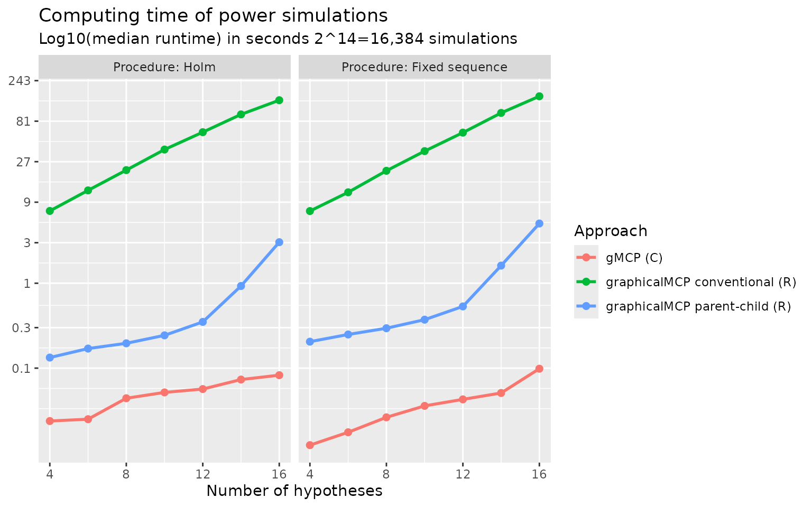

# Rationales to generate the closure and the weighting strategy of a graph

## Motivating example

Consider a simple successive graph with four hypotheses. It has two
primary hypotheses $H_{1}$ and $H_{2}$ and two secondary hypotheses
$H_{3}$ and $H_{4}$. Initially, hypothesis weights are split equally
between $H_{1}$ and $H_{2}$ with 0.5. Hypotheses $H_{3}$ and $H_{4}$
receive 0 hypothesis weights because $H_{3}\left( H_{4} \right)$ is
tested only if $H_{1}\left( H_{2} \right)$ is rejected. Thus there is an
edge from $H_{1}\left( H_{2} \right)$ to $H_{3}\left( H_{4} \right)$
with a transition weight of 1. When both $H_{1}$ and $H_{3}$ are
rejected, their hypothesis weights are propagated to $H_{2}$; similarly,
when both $H_{2}$ and $H_{4}$ are rejected, their hypothesis weights are
propagated to $H_{1}$. Thus there is an edge from
$H_{3}\left( H_{4} \right)$ to $H_{2}\left( H_{1} \right)$ with a
transition weight of 1. A graphical multiple comparison procedure is
illustrated below.

## Generating the closure

The closure of this multiple comparison procedure is a collection of
intersection hypotheses $H_{1} \cap H_{2} \cap H_{3} \cap H_{4}$,
$H_{1} \cap H_{2} \cap H_{3}$, $H_{1} \cap H_{2} \cap H_{4}$,
$H_{1} \cap H_{3} \cap H_{4}$,
$H_{2} \cap H_{3} \cap H_{4}\ \ldots,H_{1},H_{2},H_{3}$, and $H_{4}$. In
other words, these intersection hypotheses consist of intersections
based on all non-empty subsets of $\{ 1,2,3,4\}$, e.g., $\{ 1,2,3\}$,
$\{ 1,2,4\}$, $\{ 1,3,4\}$, $\{ 2,3,4\}$, $\ldots$. Thus there are
$2^{4} - 1$ intersection hypotheses. An equivalent way to generate all
intersection hypotheses is to use a binary representation. For example,
the intersection hypothesis $H_{1} \cap H_{2} \cap H_{3} \cap H_{4}$
corresponds to $(1,1,1,1)$ and $H_{1} \cap H_{2} \cap H_{3}$ corresponds
to $(1,1,1,0)$. Then the closure can be indexed by the power set of
$\{ 1,2,3,4\}$ as below. In general, one can use
`rev(expand.grid(rep(list(1:0), m)))` to general the closure, where $m$
is the number of hypotheses.

    #>    H1 H2 H3 H4
    #> 1   1  1  1  1
    #> 2   1  1  1  0
    #> 3   1  1  0  1
    #> 4   1  1  0  0
    #> 5   1  0  1  1
    #> 6   1  0  1  0
    #> 7   1  0  0  1
    #> 8   1  0  0  0
    #> 9   0  1  1  1
    #> 10  0  1  1  0
    #> 11  0  1  0  1
    #> 12  0  1  0  0
    #> 13  0  0  1  1
    #> 14  0  0  1  0
    #> 15  0  0  0  1

### Calculating the weighting strategy

Given the closure, one can calculate the hypothesis weight associated
with every hypothesis in every intersection hypothesis using Algorithm 1
(Bretz et al. 2011). The whole collection of hypothesis weights is
called a weighting strategy. For example, hypothesis weights are
$(0.5,0.5,0,0)$ for the intersection hypothesis
$H_{1} \cap H_{2} \cap H_{3} \cap H_{4}$. Then hypothesis weights for
the intersection hypothesis $H_{1} \cap H_{2} \cap H_{3}$ are
$(0.5,0.5,0,0)$, which can be calculated by removing $H_{4}$ from the
initial graph and applying Algorithm 1 (Bretz et al. 2011). The
algorithm calculates hypothesis weights in a step-by-step fashion. For
example, for the intersection hypothesis $H_{1} \cap H_{2}$, it can
start from $H_{1} \cap H_{2} \cap H_{3} \cap H_{4}$ and calculates
hypothesis weights for $H_{1} \cap H_{2} \cap H_{3}$ by removing $H_{4}$
and then calculates hypothesis weights for $H_{1} \cap H_{2}$ by
removing $H_{3}$; it can also start from $H_{1} \cap H_{2} \cap H_{3}$
(assuming its hypotheses weights are stored) and calculates hypothesis
weights for $H_{1} \cap H_{2}$ by removing $H_{3}$. Therefore, there are
two strategies to calculate the weighting strategy.

    #>      H1   H2   H3   H4
    #> 1  0.50 0.50 0.00 0.00
    #> 2  0.50 0.50 0.00 0.00
    #> 3  0.50 0.50 0.00 0.00
    #> 4  0.50 0.50 0.00 0.00
    #> 5  0.75 0.00 0.00 0.25
    #> 6  1.00 0.00 0.00 0.00
    #> 7  0.75 0.00 0.00 0.25
    #> 8  1.00 0.00 0.00 0.00
    #> 9  0.00 0.75 0.25 0.00
    #> 10 0.00 0.75 0.25 0.00
    #> 11 0.00 1.00 0.00 0.00
    #> 12 0.00 1.00 0.00 0.00
    #> 13 0.00 0.00 0.50 0.50
    #> 14 0.00 0.00 1.00 0.00
    #> 15 0.00 0.00 0.00 1.00

#### Approach 1: Simple approach

The first strategy utilizes the initial graph as the starting point and
calculates hypothesis weights for all other intersection hypotheses. For
example, to calculate hypothesis weights for $H_{1} \cap H_{2}$, it will
start with the intersection hypothesis
$H_{1} \cap H_{2} \cap H_{3} \cap H_{4}$ and sequentially remove $H_{4}$
and $H_{3}$ (or in the other order). This approach is simple to
implement since hypothesis weights for
$H_{1} \cap H_{2} \cap H_{3} \cap H_{4}$ are determined by the initial
graph and always available. This approach is similar to the one
implemented in the `gMCP` R package. The drawback is that it does not
use other information to reduce the number of calculations. For example,
it is possible that hypothesis weights for $H_{1} \cap H_{2} \cap H_{3}$
have been calculated when calculating for $H_{1} \cap H_{2}$. Using the
information from $H_{1} \cap H_{2} \cap H_{3}$ would only need the
one-step calculation, compared to the two-step calculation using
$H_{1} \cap H_{2} \cap H_{3} \cap H_{4}$.

#### Approach 2: Parent-child approach

This approach tries to avoid the drawback of Approach 1 by saving
intermediate graphs. Then it only performs one-step calculation which
could save time. In general, an intersection hypothesis has a parent
intersection hypothesis, which involves all hypotheses involved in the
first intersection and has one extra hypothesis. For example, the second
row of `matrix_intersections` is $H_{1} \cap H_{2} \cap H_{3}$ and its
parent intersection is $H_{1} \cap H_{2} \cap H_{3} \cap H_{4}$ in the
first row; the third row of `matrix_intersections` is
$H_{1} \cap H_{2} \cap H_{4}$ and its parent intersection is
$H_{1} \cap H_{2} \cap H_{3} \cap H_{4}$ in the first row. Thus we can
identify the parent intersection hypothesis for each row in
`matrix_intersections` (except row 1) as the row number 1, 1, 2, 1, 2,
3, 4, 1, 2, 3, 4, 5, 6, 7. Given this sequence of parent hypotheses, it
is simple to obtain hypothesis weights for an intersection hypothesis
based on its parent intersection hypothesis via one-step calculation.

It is of interest to understand this pattern and obtain it efficiently.
First, between the bottom half (rows 9 - 15) and top half (rows 1 - 7),
each row’s parent in the bottom half is the corresponding row in the top
half, eight rows up, because the only difference is the flipping of
$H_{1}$ from 1 in the top half to 0 in the bottom half. For example, row
15’s parent is in row 15 - 8 = 7. Using this observation, we can
determine parent hypotheses for rows from 9 to 15 as 1, 2, 3, 4, 5, 6,
7. A similar pattern can be observed for rows from 5 to 8. Their parent
hypotheses are in rows 1, 2, 3, 4, respectively, by flipping $H_{2}$
from 1 to 0. For rows 3 - 4, their parent hypotheses are in rows 1, 2,
respectively, by flipping $H_{3}$ from 1 to 0. Lastly for row 2, its
parent hypothesis is in row 1. The row number of the parent hypothesis
can be efficiently generated by running
`do.call(c, lapply(2^(seq_len(m) - 1), seq_len))[-2^m, ]`, where $m$ is
the number of hypotheses.

### Comparing different approaches to calculating weighting strategies

To benchmark against existing approaches to calculating weighting
strategies, we compare the following approaches:
[`gMCP::generateWeights()`](https://rdrr.io/pkg/gMCP/man/generateWeights.html)
(Rohmeyer and Klinglmueller 2024),
[`lrstat::fwgtmat()`](https://rdrr.io/pkg/lrstat/man/fwgtmat.html) (Lu
2016), Approach 1 (graphicalMCP simple) and Approach 2 (graphicalMCP
parent-child). Random graphs are generated for the numbers of hypotheses
of 4, 8, 12, and 16. Computing time (in median log-10 milliseconds) is
plotted below. We can see that
[`gMCP::generateWeights()`](https://rdrr.io/pkg/gMCP/man/generateWeights.html)
is the slowest and
[`lrstat::fwgtmat()`](https://rdrr.io/pkg/lrstat/man/fwgtmat.html) is
the fastest. Approach 2 (graphicalMCP parent-child) is faster than
Approach 1 (graphicalMCP simple). Note that
[`lrstat::fwgtmat()`](https://rdrr.io/pkg/lrstat/man/fwgtmat.html)
implements the calculation using C++, which is known to be faster than
R. But it is less stable than other approaches, e.g., giving errors more
often than others. Given that the computing time of R-based approaches
is acceptable, adding Rcpp dependency is not considered in
`graphicalMCP`. For these considerations, we implement Approach 2 in
[`graphicalMCP::graph_generate_weights()`](https://openpharma.github.io/graphicalMCP/reference/graph_generate_weights.md).

## Improving power simulations using parent-child relationships

### Conventional approach for power simulations

The conventional approach for power simulations is to repeat the
following process many times, e.g., 100,000 times.

1.  Simulate a set of p-values
2.  Run the graphical multiple comparison procedure to
    - Determine which hypothesis can be rejected
    - Remove the rejected hypothesis and update the graph
    - Repeat until no more hypotheses can be rejected

Note that the same step to update the graph may repeat in many
replications, which may be repetitive. For $m$ hypotheses, there are at
most $2^{m} - 1$ graphs depending on which hypotheses are rejected.
These graphs correspond to the closure and the weighting strategy. Thus
an idea to avoid redundant updating of graphs is to utilize the
weighting strategy.

### Power simulations using parent-child relationships

The key to allow this approach is to efficiently identify the row of the
weighting strategy, given which hypotheses are rejected. Remembering the
pattern we found for Approach 2, the bottom half (rows 9 - 15) of
`matrix_intersections` is the same as the top half (rows 1 - 7), except
flipping $H_{1}$ from 1 to 0. This means that if $H_{1}$ has not been
rejected (1 for $H_{1}$ in `matrix_intersections`), the row number of
that index should be in the top half. For example, assume that $H_{2}$
and $H_{4}$ have been rejected and the index in `matrix_intersections`
should be $(1,0,1,0)$. Since $H_{1}$ is 1, the corresponding row should
be in the top half (rows 1- 7). But $H_{2}$ is 0 and thus the
corresponding row should be in the bottom half within the top half (rows
5 - 7). Since $H_{3}$ is 1 and thus the corresponding row should be in
the top half (rows 5 - 6). But $H_{4}$ is 0 and thus the corresponding
row should be 6. A useful way to calculate the row number for an index
of XXXX is `2^m - sum(XXXX * 2^(m:1 - 1))`. For example for XXXX=1010,
its row number should be
`(1 - 1) * 8 + (1 - 0) * 4 + (1 - 1) * 2 + (1 - 0) * 1 + 1 = 16 - 10 = 6`.

With the above way of efficiently identifying rows of
`weighting_strategy`, power simulations could be implemented as follows:

1.  Obtain the weighting strategy (once for all simulations)
2.  Simulate a set of p-values
3.  Run the graphical multiple comparison procedure to
    - Determine which hypothesis can be rejected
    - Remove the rejected hypothesis and identify the row of the
      weighting strategy
    - Repeat until no more hypotheses can be rejected

The small modification in Step 3b makes this approach much faster than
the conventional approach for power simulations.

### Comparing different approaches to power simulations

To benchmark against existing approaches to calculating weighting
strategies, we compare the following approaches:
[`gMCP::calcPower()`](https://rdrr.io/pkg/gMCP/man/calcPower.html),
Approach 1 (graphicalMCP conventional), and Approach 2 (graphicalMCP
parent-child). Both Holm and fixed sequence procedures are considered
with the numbers of hypotheses of 4, 8, 12, and 16. Computing time (in
median log-10 seconds) is plotted below. We can see that
[`gMCP::calcPower()`](https://rdrr.io/pkg/gMCP/man/calcPower.html) is
the fastest and Approach 1 (graphicalMCP conventional) is the lowest.
Note that
[`gMCP::calcPower()`](https://rdrr.io/pkg/gMCP/man/calcPower.html)
implements the simulation using C, which is known to be faster than R
but is not easy to extend to other situations. Given that the computing
time of Approach 2 (graphicalMCP parent-child) is acceptable, we
implement it in
[`graphicalMCP::graph_calculate_power()`](https://openpharma.github.io/graphicalMCP/reference/graph_calculate_power.md).

## Reference

Bretz, Frank, Martin Posch, Ekkehard Glimm, Florian Klinglmueller, Willi
Maurer, and Kornelius Rohmeyer. 2011. “Graphical Approaches for Multiple
Comparison Procedures Using Weighted Bonferroni, Simes, or Parametric
Tests.” *Biometrical Journal* 53 (6): 894–913.
<https://doi.org/10.1002/bimj.201000239>.

Lu, Kaifeng. 2016. “Graphical Approaches Using a Bonferroni Mixture of
Weighted Simes Tests.” *Statistics in Medicine* 35 (22): 4041–55.
<https://doi.org/10.1002/sim.6985>.

Rohmeyer, Kornelius, and Florian Klinglmueller. 2024. *gMCP: Graph Based
Multiple Test Procedures*. <https://cran.r-project.org/package=gMCP>.
