# Common multiple comparison procedures illustrated using graphicalMCP

``` r
library(graphicalMCP)
```

## Introduction

In confirmatory clinical trials, regulatory guidelines mandate the
strong control of the family-wise error rate at a prespecified level
$\alpha$. Many multiple comparison procedures (MCPs) have been proposed
for this purpose. The graphical approaches are a general framework that
include many common MCPs as special cases. In this vignette, we
illustrate how to use graphicalMCP to perform some common MCPs.

To test $m$ hypotheses using a graphical MCP, each hypothesis $H_{i}$
receives a weight $0 \leq w_{i} \leq 1$ (called hypothesis weight),
where $\sum_{i = 1}^{m}w_{i} \leq 1$. From $H_{i}$ to $H_{j}$, there
could be a directed and weighted edge $0 \leq g_{ij} \leq 1$, which
means that when $H_{i}$ is rejected, its hypothesis weight will be
propagated (or transferred) to $H_{j}$ and $g_{ij}$ determines how much
of the propagation. We also require $\sum_{j = 1}^{m}g_{ij} \leq 1$ and
$g_{ii} = 0$.

## Bonferroni-based procedures

### Bonferroni test

A Bonferroni test splits $\alpha$ equally among hypotheses by testing
every hypothesis at a significance level of $\alpha$ divided by the
number of hypotheses. Thus it rejects a hypothesis if its p-value is
less than or equal to its significance level. There is no propagation
between any pair of hypothesis.

``` r
set.seed(1234)
alpha <- 0.025
m <- 3
bonferroni_graph <- bonferroni(m)
# transitions <- matrix(0, m, m)
# bonferroni_graph <- graph_create(rep(1 / m, m), transitions)

plot(
  bonferroni_graph,
  layout = igraph::layout_in_circle(
    as_igraph(bonferroni_graph),
    order = c(2, 1, 3)
  ),
  vertex.size = 70
)
```


``` r

p_values <- runif(m, 0, alpha)

test_results <-
  graph_test_shortcut(
    bonferroni_graph,
    p = p_values,
    alpha = alpha
  )

test_results$outputs$rejected
#>    H1    H2    H3 
#>  TRUE FALSE FALSE
```

### Weighted Bonferroni test

A weighted Bonferroni test splits $\alpha$ among hypotheses by testing
every hypothesis at a significance level of $w_{i}\alpha$. Thus it
rejects a hypothesis if its p-value is less than or equal to its
significance level. When $w_{i} = w_{j}$ for all $i,j$, this means an
equal split and the test is the Bonferroni test. There is no propagation
between any pair of hypothesis.

``` r
set.seed(1234)
alpha <- 0.025
hypotheses <- c(0.5, 0.3, 0.2)
weighted_bonferroni_graph <- bonferroni_weighted(hypotheses)
# m <- length(hypotheses)
# transitions <- matrix(0, m, m)
# weighted_bonferroni_graph <- graph_create(hypotheses, transitions)

plot(
  weighted_bonferroni_graph,
  layout = igraph::layout_in_circle(
    as_igraph(bonferroni_graph),
    order = c(2, 1, 3)
  ),
  vertex.size = 70
)
```

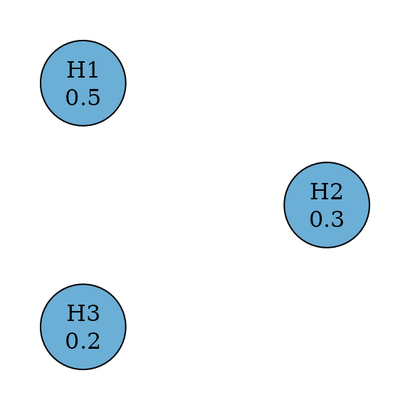

``` r

p_values <- runif(m, 0, alpha)

test_results <-
  graph_test_shortcut(
    weighted_bonferroni_graph,
    p = p_values,
    alpha = alpha
  )

test_results$outputs$rejected
#>    H1    H2    H3 
#>  TRUE FALSE FALSE
```

### Holm Procedure

Holm (or Bonferroni-Holm) procedures improve over Bonferroni tests by
allowing propagation (Holm 1979). In other words, transition weights
between hypotheses may not be zero. So it is uniformly more powerful
than Bonferroni tests.

``` r
set.seed(1234)
alpha <- 0.025
m <- 3
holm_graph <- bonferroni_holm(m)
# transitions <- matrix(1 / (m - 1), m, m)
# diag(transitions) <- 0
# holm_graph <- graph_create(rep(1 / m, m), transitions)

plot(holm_graph,
  layout = igraph::layout_in_circle(
    as_igraph(holm_graph),
    order = c(2, 1, 3)
  ),
  vertex.size = 70
)
```


``` r

p_values <- runif(m, 0, alpha)

test_results <- graph_test_shortcut(holm_graph, p = p_values, alpha = alpha)

test_results$outputs$rejected
#>    H1    H2    H3 
#>  TRUE FALSE FALSE
```

### Weighted Holm Procedure

Weighted Holm (or weighted Bonferroni-Holm) procedures improve over
weighted Bonferroni tests by allowing propagation (Holm 1979). In other
words, transition weights between hypotheses may not be zero. So it is
uniformly more powerful than weighted Bonferroni tests.

``` r
set.seed(1234)
alpha <- 0.025
hypotheses <- c(0.5, 0.3, 0.2)
weighted_holm_graph <- bonferroni_holm_weighted(hypotheses)
# m <- length(hypotheses)
# transitions <- matrix(1 / (m - 1), m, m)
# diag(transitions) <- 0
# weighted_holm_graph <- graph_create(hypotheses, transitions)

plot(weighted_holm_graph,
  layout = igraph::layout_in_circle(
    as_igraph(holm_graph),
    order = c(2, 1, 3)
  ),
  vertex.size = 70
)
```

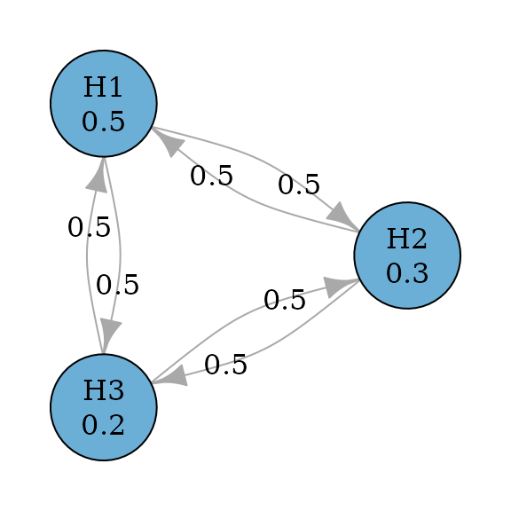

``` r

p_values <- runif(m, 0, alpha)

test_results <- graph_test_shortcut(weighted_holm_graph, p = p_values, alpha = alpha)

test_results$outputs$rejected
#>    H1    H2    H3 
#>  TRUE FALSE FALSE
```

### Fixed sequence procedure

Fixed sequence (or hierarchical) procedures pre-specify an order of
testing Westfall and Krishen (2001). For example, the procedure will
test $H_{1}$ first. If it is rejected, it will test $H_{2}$; otherwise
the testing stops. If $H_{2}$ is rejected, it will test $H_{3}$;
otherwise the testing stops. For each hypothesis, it will be tested at
the full $\alpha$ level, when it can be tested.

``` r
set.seed(1234)
alpha <- 0.025
m <- 3
fixed_sequence_graph <- fixed_sequence(m)
# transitions <- rbind(
#   c(0, 1, 0),
#   c(0, 0, 1),
#   c(0, 0, 0)
# )
# fixed_sequence_graph <- graph_create(c(1, 0, 0), transitions)

plot(fixed_sequence_graph, nrow = 1, asp = 0.5, vertex.size = 50)
```

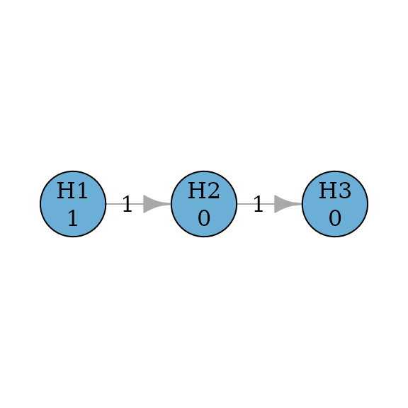

``` r

p_values <- runif(m, 0, alpha)

test_results <-
  graph_test_shortcut(
    fixed_sequence_graph,
    p = p_values,
    alpha = alpha
  )

test_results$outputs$rejected
#>   H1   H2   H3 
#> TRUE TRUE TRUE
```

### Fallback procedure

Fallback procedures have one-way propagation (like fixed sequence
procedures) but allow hypotheses to be tested at different significance
levels (Wiens 2003).

``` r
set.seed(1234)
alpha <- 0.025
hypotheses <- c(0.5, 0.3, 0.2)
m <- length(hypotheses)
fallback_graph <- fallback(hypotheses)
# transitions <- rbind(
#   c(0, 1, 0),
#   c(0, 0, 1),
#   c(0, 0, 0)
# )
# fallback_graph <- graph_create(hypotheses, transitions)

plot(fallback_graph, nrow = 1, asp = 0.5, vertex.size = 50)
```

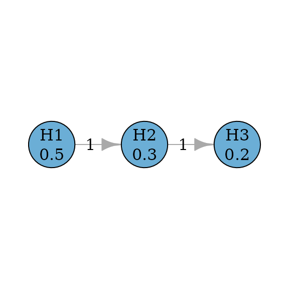

``` r

p_values <- runif(m, 0, alpha)

test_results <-
  graph_test_shortcut(
    fallback_graph,
    p = p_values,
    alpha = alpha
  )

test_results$outputs$rejected
#>   H1   H2   H3 
#> TRUE TRUE TRUE
```

Further they can be improved to allow propagation from later hypotheses
to earlier hypotheses, because it is possible that a later hypothesis is
rejected before an earlier hypothesis can be rejected. There are two
versions of improvement: `fallback_improved_1` due to Wiens and
Dmitrienko (2005) and `fallback_improved_2` due to Bretz et al. (2009)
respectively.

``` r
set.seed(1234)
alpha <- 0.025
hypotheses <- c(0.5, 0.3, 0.2)
m <- length(hypotheses)
fallback_improved_1_graph <- fallback_improved_1(hypotheses)
# transitions <- rbind(
#   c(0, 1, 0),
#   c(0, 0, 1),
#   c(hypotheses[seq_len(m - 1)] / sum(hypotheses[seq_len(m - 1)]), 0)
# )
# fallback_improved_1_graph <- graph_create(hypotheses, transitions)
plot_layout <- rbind(
  c(0, 0.8),
  c(0.8, 0.8),
  c(0.4, 0)
)

plot(
  fallback_improved_1_graph,
  layout = plot_layout,
  asp = 0.5,
  edge_curves = c(pairs = 0.5),
  vertex.size = 70
)
```

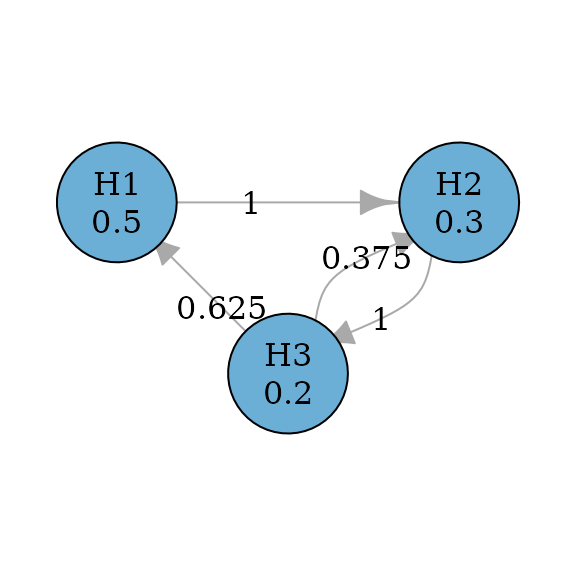

``` r

epsilon <- 0.0001
fallback_improved_2_graph <- fallback_improved_2(hypotheses, epsilon)
# transitions <- rbind(
#   c(0, 1, 0),
#   c(1 - epsilon, 0, epsilon),
#   c(1, 0, 0)
# )
# fallback_improved_2_graph <- graph_create(hypotheses, transitions)
plot_layout <- rbind(
  c(0, 0.8),
  c(0.8, 0.8),
  c(0.4, 0)
)

plot(
  fallback_improved_2_graph,
  layout = plot_layout,
  eps = 0.0001,
  asp = 0.5,
  edge_curves = c(pairs = 0.5),
  vertex.size = 70
)
```

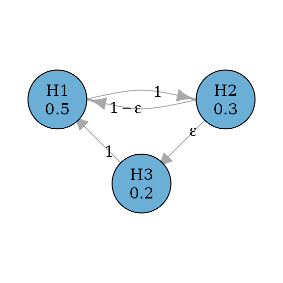

``` r

p_values <- runif(m, 0, alpha)

test_results <-
  graph_test_shortcut(
    fallback_improved_2_graph,
    p = p_values,
    alpha = alpha
  )

test_results$outputs$rejected
#>   H1   H2   H3 
#> TRUE TRUE TRUE
```

### Serial gatekeeping procedure

Serial gatekeeping procedures involve ordered multiple families of
hypotheses, where all hypotheses of a family of hypotheses must be
rejected before proceeding in the test sequence. The example below
considers a primary family consisting of two hypotheses $H_{1}$ and
$H_{2}$ and a secondary family consisting of a single hypothesis
$H_{3}$. In the primary family, the Holm procedure is applied. If both
$H_{1}$ and $H_{2}$ are rejected, $H_{3}$ can be tested at level
$\alpha$; otherwise $H_{3}$ cannot be rejected. To allow the conditional
propagation to $H_{3}$, an $\varepsilon$ edge is used from $H_{2}$ to
$H_{3}$. It has a very small transition weight so that $H_{2}$
propagates most of its hypothesis weight to $H_{1}$ (if not already
rejected) and retains a small (non-zero) weight for $H_{3}$ so that if
$H_{1}$ has been rejected, all hypothesis weight of $H_{2}$ will be
propagated to $H_{3}$. Here $\varepsilon$ is assigned to be 0.0001 and
in practice, the value could be adjusted but it should be much smaller
than the smallest p-value observed.

``` r
set.seed(1234)
alpha <- 0.025
m <- 3
epsilon <- 0.0001

transitions <- rbind(
  c(0, 1, 0),
  c(1 - epsilon, 0, epsilon),
  c(0, 0, 0)
)

serial_gatekeeping_graph <- graph_create(c(0.5, 0.5, 0), transitions)

plot_layout <- rbind(
  c(0, 0.8),
  c(0.8, 0.8),
  c(0.4, 0)
)

plot(
  serial_gatekeeping_graph,
  layout = plot_layout,
  eps = 0.0001,
  asp = 0.5,
  edge_curves = c(pairs = 0.5),
  vertex.size = 70
)
```

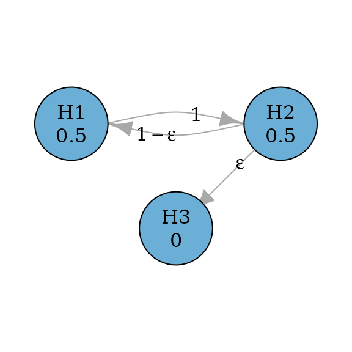

``` r

p_values <- runif(m, 0, alpha)

test_results <-
  graph_test_shortcut(
    serial_gatekeeping_graph,
    p = p_values,
    alpha = alpha
  )

test_results$outputs$rejected
#>   H1   H2   H3 
#> TRUE TRUE TRUE
```

### Parallel gatekeeping procedure

Parallel gatekeeping procedures also involve multiple ordered families
of hypotheses, where any null hypotheses of a family of hypotheses must
be rejected before proceeding in the test sequence (Dmitrienko, Offen,
and Westfall 2003). The example below considers a primary family
consisting of two hypotheses $H_{1}$ and $H_{2}$ and a secondary family
consisting of two hypotheses $H_{3}$ and $H_{4}$. In the primary family,
the Bonferroni test is applied. If any of $H_{1}$ and $H_{2}$ is
rejected, $H_{3}$ and $H_{4}$ can be tested at level $\alpha/2$ using
the Holm procedure; if both $H_{1}$ and $H_{2}$ are rejected, $H_{3}$
and $H_{4}$ can be tested at level $\alpha$ using the Holm procedure;
otherwise $H_{3}$ and $H_{4}$ cannot be rejected.

``` r
set.seed(1234)
alpha <- 0.025
m <- 4

transitions <- rbind(
  c(0, 0, 0.5, 0.5),
  c(0, 0, 0.5, 0.5),
  c(0, 0, 0, 1),
  c(0, 0, 1, 0)
)

parallel_gatekeeping_graph <- graph_create(c(0.5, 0.5, 0, 0), transitions)

plot(parallel_gatekeeping_graph, vertex.size = 70)
```

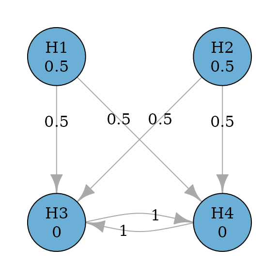

``` r

p_values <- runif(m, 0, alpha)

test_results <-
  graph_test_shortcut(
    parallel_gatekeeping_graph,
    p = p_values,
    alpha = alpha
  )

test_results$outputs$rejected
#>    H1    H2    H3    H4 
#>  TRUE FALSE FALSE FALSE
```

The above parallel gatekeeping procedure can be improved by adding
$\varepsilon$ edges from secondary hypotheses to primary hypotheses,
because it is possible that both secondary hypotheses are rejected but
there is still a remaining primary hypothesis not rejected (Bretz et al.
2009).

``` r
set.seed(1234)
alpha <- 0.025
m <- 4
epsilon <- 0.0001

transitions <- rbind(
  c(0, 0, 0.5, 0.5),
  c(0, 0, 0.5, 0.5),
  c(epsilon, 0, 0, 1 - epsilon),
  c(0, epsilon, 1 - epsilon, 0)
)

parallel_gatekeeping_improved_graph <-
  graph_create(c(0.5, 0.5, 0, 0), transitions)

plot(parallel_gatekeeping_improved_graph, eps = 0.0001, vertex.size = 70)
```

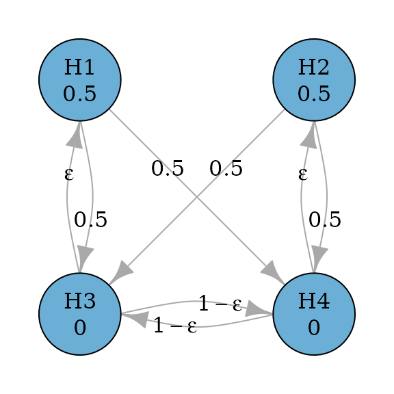

``` r

p_values <- runif(m, 0, alpha)

test_results <-
  graph_test_shortcut(
    parallel_gatekeeping_improved_graph,
    p = p_values,
    alpha = alpha
  )

test_results$outputs$rejected
#>    H1    H2    H3    H4 
#>  TRUE FALSE FALSE FALSE
```

### Successive procedure

Successive procedures incorporate successive relationships between
hypotheses. For example, the secondary hypothesis is not tested until
the primary hypothesis has been rejected. This is similar to using the
fixed sequence procedure as a component of a graph. The example below
considers two primary hypotheses $H_{1}$ and $H_{2}$ and two secondary
hypotheses $H_{3}$ and $H_{4}$. Primary hypotheses $H_{1}$ and $H_{2}$
receive the equal hypothesis weight of 0.5; secondary hypotheses $H_{3}$
and $H_{4}$ receive the hypothesis weight of 0. A secondary hypothesis
$H_{3}\left( H_{4} \right)$ can be tested only if the corresponding
primary hypothesis $H_{1}\left( H_{2} \right)$ has been rejected. This
represents the successive relationships between $H_{1}$ and $H_{3}$, and
$H_{2}$ and $H_{4}$, respectively (Maurer, Glimm, and Bretz 2011). If
both $H_{1}$ and $H_{3}$ are rejected, their hypothesis weights are
propagated to $H_{2}$ and $H_{4}$, and vice versa.

``` r
set.seed(1234)
alpha <- 0.025
m <- 4
simple_successive_graph <- simple_successive_1()
# transitions <- rbind(
#   c(0, 0, 1, 0),
#   c(0, 0, 0, 1),
#   c(0, 1, 0, 0),
#   c(1, 0, 0, 0)
# )
# simple_successive_graph <- graph_create(c(0.5, 0.5, 0, 0), transitions)

plot(simple_successive_graph, layout = "grid", nrow = 2, vertex.size = 70)
```

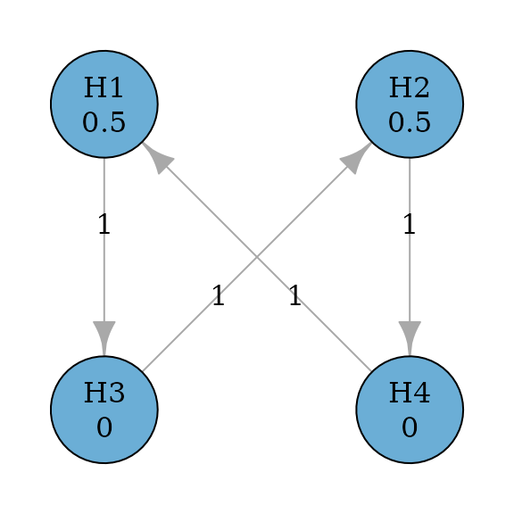

``` r

p_values <- runif(m, 0, alpha)

test_results <-
  graph_test_shortcut(
    simple_successive_graph,
    p = p_values,
    alpha = alpha
  )

test_results$outputs$rejected
#>    H1    H2    H3    H4 
#>  TRUE FALSE FALSE FALSE
```

The above graph could be generalized to allow propagation between
primary hypotheses (Maurer, Glimm, and Bretz 2011). A general successive
graph is illustrate below with a variable to determine the propagation
between $H_{1}$ and $H_{2}$.

``` r
set.seed(1234)
alpha <- 0.025
m <- 4

successive_var <- simple_successive_var <- function(gamma) {
  graph_create(
    c(0.5, 0.5, 0, 0),
    rbind(
      c(0, gamma, 1 - gamma, 0),
      c(gamma, 0, 0, 1 - gamma),
      c(0, 1, 0, 0),
      c(1, 0, 0, 0)
    )
  )
}

successive_var_graph <- successive_var(0.5)
plot(successive_var_graph, layout = "grid", nrow = 2, vertex.size = 70)
```

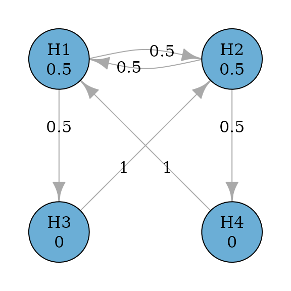

``` r
p_values <- runif(m, 0, alpha)

test_results <-
  graph_test_shortcut(
    successive_var_graph,
    p = p_values,
    alpha = alpha
  )

test_results$outputs$rejected
#>    H1    H2    H3    H4 
#>  TRUE  TRUE FALSE FALSE
```

## Hochberg-based procedures

### Hochberg procedure

Hochberg procedure (Hochberg 1988) is a closed test procedure which uses
Hochberg tests for every intersection hypothesis. According to Xi and
Bretz (2019), the graph for Hochberg procedures is the same as the graph
for Holm procedures. Thus to perform Hochberg procedure, we just need to
specify `test_type` to be `hochberg`.

``` r
set.seed(1234)
alpha <- 0.025
m <- 3
hochberg_graph <- hochberg(m)

plot(
  hochberg_graph,
  layout = igraph::layout_in_circle(
    as_igraph(hochberg_graph),
    order = c(2, 1, 3)
  ),
  vertex.size = 70
)
```


``` r

p_values <- runif(m, 0, alpha)

test_results <- graph_test_closure(
  hochberg_graph,
  p = p_values,
  alpha = alpha,
  test_types = "hochberg"
)

test_results$outputs$rejected
#>   H1   H2   H3 
#> TRUE TRUE TRUE
```

## Simes-based procedures

### Hommel procedure

Hommel procedure (Hommel 1988) is a closed test procedure which uses
Simes tests for every intersection hypothesis. According to Xi and Bretz
(2019), the graph for Hommel procedures is the same as the graph for
Holm procedures. Thus to perform Hommel procedure, we just need to
specify `test_type` to be `simes`.

``` r
set.seed(1234)
alpha <- 0.025
m <- 3
hommel_graph <- hommel(m)

plot(
  hommel_graph,
  layout = igraph::layout_in_circle(
    as_igraph(hommel_graph),
    order = c(2, 1, 3)
  ),
  vertex.size = 70
)
```

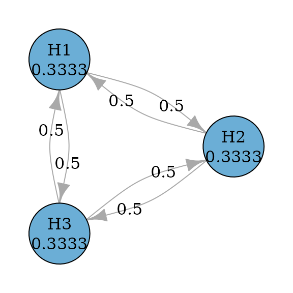

``` r

p_values <- runif(m, 0, alpha)

test_results <- graph_test_closure(
  hommel_graph,
  p = p_values,
  alpha = alpha,
  test_types = "simes"
)

test_results$outputs$rejected
#>   H1   H2   H3 
#> TRUE TRUE TRUE
```

## Parametric procedures

### Šidák test

The Šidák test is similar to the equally weighted Bonferroni test but it
assumes test statistics are independent of each other (Šidák 1967). Thus
it can be performed as a parametric procedure with the identity
correlation matrix. Its graph is the same as the graph for the equally
weighted Bonferroni test.

``` r
set.seed(1234)
alpha <- 0.025
m <- 3
sidak_graph <- sidak(m)

plot(
  sidak_graph,
  layout = igraph::layout_in_circle(
    as_igraph(bonferroni_graph),
    order = c(2, 1, 3)
  ),
  vertex.size = 70
)
```


``` r

p_values <- runif(m, 0, alpha)
corr <- diag(m)

test_results <- graph_test_closure(
  sidak_graph,
  p = p_values, alpha = alpha,
  test_types = "parametric",
  test_corr = list(corr)
)

test_results$outputs$rejected
#>    H1    H2    H3 
#>  TRUE FALSE FALSE
```

### Dunnett test

Single-step Dunnett tests are an improvement from Bonferroni tests by
incorporating the correlation structure between test statistics (Dunnett
1955). Thus their graphs are the same as Bonferroni tests. Assume an
equi-correlated case, where the correlation between any pair of test
statistics is the same, e.g., 0.5. Then we can perform the single-step
Dunnett test by specifying `test_type` to be `parametric` and providing
the correlation matrix.

``` r
set.seed(1234)
alpha <- 0.025
m <- 3
dunnett_graph <- dunnett_single_step(m)

plot(
  dunnett_graph,
  layout = igraph::layout_in_circle(
    as_igraph(dunnett_graph),
    order = c(2, 1, 3)
  ),
  vertex.size = 70
)
```

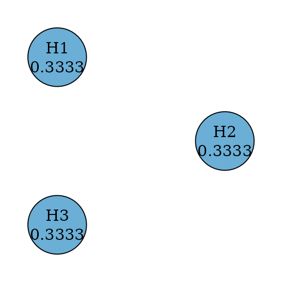

``` r

p_values <- runif(m, 0, alpha)
corr <- matrix(0.5, m, m)
diag(corr) <- 1

test_results <- graph_test_closure(
  dunnett_graph,
  p = p_values, alpha = alpha,
  test_types = "parametric",
  test_corr = list(corr)
)

test_results$outputs$rejected
#>    H1    H2    H3 
#>  TRUE FALSE FALSE
```

### Weighted Dunnett test

Weighted single-step Dunnett tests are an improvement from weighted
Bonferroni tests by incorporating the correlation structure between test
statistics (Xi et al. 2017). Thus their graphs are the same as weighted
Bonferroni tests. Assume an equi-correlated case, where the correlation
between any pair of test statistics is the same, e.g., 0.5. Then we can
perform the weighted single-step Dunnett test by specifying `test_type`
to be `parametric` and providing the correlation matrix.

``` r
set.seed(1234)
alpha <- 0.025
hypotheses <- c(0.5, 0.3, 0.2)
dunnett_graph <- dunnett_single_step_weighted(hypotheses)

plot(
  dunnett_graph,
  layout = igraph::layout_in_circle(
    as_igraph(dunnett_graph),
    order = c(2, 1, 3)
  ),
  vertex.size = 70
)
```


``` r

p_values <- runif(m, 0, alpha)
corr <- matrix(0.5, m, m)
diag(corr) <- 1

test_results <- graph_test_closure(
  dunnett_graph,
  p = p_values, alpha = alpha,
  test_types = "parametric",
  test_corr = list(corr)
)

test_results$outputs$rejected
#>    H1    H2    H3 
#>  TRUE FALSE FALSE
```

### Dunnett procedure

Dunnett procedures are a closed test procedure and an improvement from
Holm procedures by incorporating the correlation structure between test
statistics (Xi et al. 2017). Thus their graphs are the same as Holm
procedures. Assume an equi-correlated case, where the correlation
between any pair of test statistics is the same, e.g., 0.5. Then we can
perform the step-down Dunnett procedure by specifying `test_type` to be
`parametric` and providing the correlation matrix.

``` r
set.seed(1234)
alpha <- 0.025
hypotheses <- c(0.5, 0.3, 0.2)
dunnett_graph <- dunnett_closure_weighted(hypotheses)

plot(
  dunnett_graph,
  layout = igraph::layout_in_circle(
    as_igraph(dunnett_graph),
    order = c(2, 1, 3)
  ),
  vertex.size = 70
)
```


``` r

p_values <- runif(m, 0, alpha)
corr <- matrix(0.5, m, m)
diag(corr) <- 1

test_results <- graph_test_closure(
  dunnett_graph,
  p = p_values, alpha = alpha,
  test_types = "parametric",
  test_corr = list(corr)
)

test_results$outputs$rejected
#>    H1    H2    H3 
#>  TRUE FALSE FALSE
```

## Reference

Bretz, Frank, Willi Maurer, Werner Branath, and Martin Posch. 2009. “A
Graphical Approach to Sequentially Rejective Multiple Test Procedures.”
*Statistics in Medicine* 53 (4): 586–604.
<https://doi.org/10.1002/sim.3495>.

Dmitrienko, Alexei, Walter W. Offen, and Peter H. Westfall. 2003.
“Gatekeeping Strategies for Clinical Trials That Do Not Require All
Primary Effects to Be Significant.” *Statistics in Medicine* 22 (15):
2387–2400. <https://doi.org/10.1002/sim.1526>.

Dunnett, Charles W. 1955. “A Multiple Comparison Procedure for Comparing
Several Treatments with a Control.” *Journal of the American Statistical
Association* 50 (272): 1096–1121.

Hochberg, Yosef. 1988. “A Sharper Bonferroni Procedure for Multiple
Tests of Significance.” *Biometrika* 75 (4): 800–802.

Holm, Sture. 1979. “A Simple Sequentially Rejective Multiple Test
Procedure.” *Scandinavian Journal of Statistics* 75: 65–70.

Hommel, Gerhard. 1988. “A Stagewise Rejective Multiple Test Procedure
Based on a Modified Bonferroni Test.” *Biometrika* 75 (2): 383–86.
<https://doi.org/10.1093/biomet/75.2.383>.

Maurer, Willi, Ekkehard Glimm, and Frank Bretz. 2011. “Multiple and
Repeated Testing of Primary, Coprimary, and Secondary Hypotheses.”
*Statistics in Biopharmaceutical Research* 3 (2): 336–52.
<https://doi.org/10.1198/sbr.2010.10010>.

Maurer, Willi, Ludwig Hothorn, and Walter Lehmacher. 1995. “Multiple
Comparisons in Drug Clinical Trials and Preclinical Assays: A-Priori
Ordered Hypotheses.” *Biometrie in Der Chemisch-Pharmazeutischen
Industrie* 6: 3–18.

Šidák, Zbyněk. 1967. “Rectangular Confidence Regions for the Means of
Multivariate Normal Distributions.” *Journal of the American Statistical
Association* 62 (318): 626–33.

Westfall, Peter H., and Alok Krishen. 2001. “Optimally Weighted, Fixed
Sequence and Gatekeeper Multiple Testing Procedures.” *Journal of
Statistical Planning and Inference* 99 (1): 25–40.
<https://doi.org/10.1016/S0378-3758(01)00077-5>.

Wiens, Brian L. 2003. “A Fixed Sequence Bonferroni Procedure for Testing
Multiple Endpoints.” *Pharmaceutical Statistics* 2 (3): 211–15.
<https://doi.org/10.1002/pst.64>.

Wiens, Brian L., and Alexei Dmitrienko. 2005. “The Fallback Procedure
for Evaluating a Aingle Family of Hypotheses.” *Journal of
Biopharmaceutical Statistics* 15 (6): 929–42.
<https://doi.org/10.1080/10543400500265660>.

Xi, Dong, and Frank Bretz. 2019. “Symmetric Graphs for Equally Weighted
Tests, with Application to the Hochberg Procedure.” *Statistics in
Medicine* 38 (27): 5268–82. <https://doi.org/10.1002/sim.8375>.

Xi, Dong, Ekkehard Glimm, Willi Maurer, and Frank Bretz. 2017. “A
Unified Framework for Weighted Parametric Multiple Test Procedures.”
*Biometrical Journal* 59 (5): 918–31.
<https://doi.org/10.1002/bimj.201600233>.
