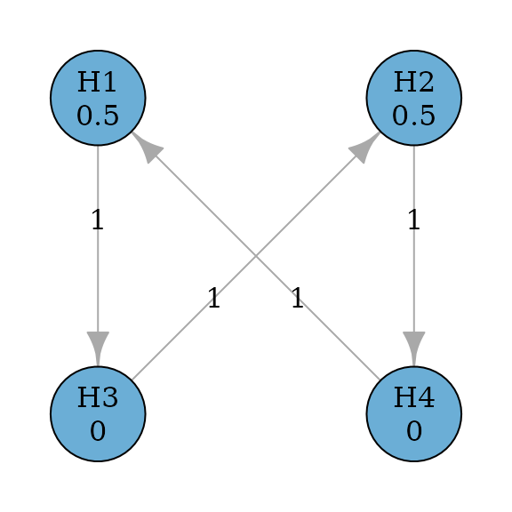
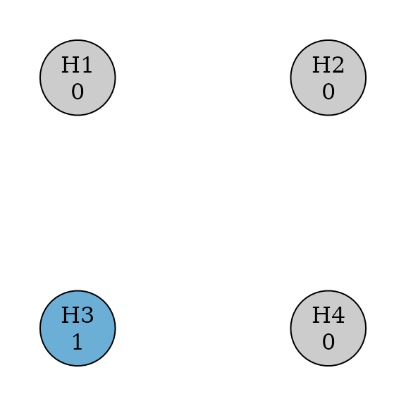

# Get started

## Introduction

Graphical approaches for multiple comparison procedures (MCPs) are a
general framework to control the familywise error rate strongly as a
pre-specified significance level $0 < \alpha < 1$. This approach
includes many commonly used MCPs as special cases and is transparent in
visualizing MCPs for better communications. `graphicalMCP` is designed
to design and analyze graphical MCPs in a flexible, informative and
efficient way.

## Basic usage

### Initial graph

The base object in `graphicalMCP` is an `initial_graph`, which consists
of a vector of hypothesis weights and a matrix of transition weights
(Bretz et al. 2009). This object can be created via
[`graph_create()`](https://openpharma.github.io/graphicalMCP/reference/graph_create.md).
In the graphical representation, hypotheses are denoted as nodes (or
vertices) associated with hypothesis weights. A directed edge from a
hypothesis to another indicates the direction of propagation of the
hypothesis weight from the origin hypothesis to the end hypothesis. The
edge is weighted by a transition weight indicating the proportion of
propagation.

``` r
library(graphicalMCP)
# A graph of two primary hypotheses (H1 and H2) and two secondary hypotheses (H3
# and H4)
hypotheses <- c(0.5, 0.5, 0, 0)
transitions <- rbind(
  c(0, 0, 1, 0),
  c(0, 0, 0, 1),
  c(0, 1, 0, 0),
  c(1, 0, 0, 0)
)
hyp_names <- c("H1", "H2", "H3", "H4")
example_graph <- graph_create(hypotheses, transitions, hyp_names)
example_graph
#> Initial graph
#> 
#> --- Hypothesis weights ---
#> H1: 0.5
#> H2: 0.5
#> H3: 0.0
#> H4: 0.0
#> 
#> --- Transition weights ---
#>     H1 H2 H3 H4
#>  H1  0  0  1  0
#>  H2  0  0  0  1
#>  H3  0  1  0  0
#>  H4  1  0  0  0
```

``` r
plot(example_graph, vertex.size = 60)
```



### Update graph

When a hypothesis is removed from the graph, hypothesis and transition
weights of remaining hypotheses should be updated according to Algorithm
1 in Bretz et al. (2011). For example, assume that hypotheses H1, H2 and
H4 are removed from the graph. The updated graph after removing three
hypotheses is below.

``` r
updated_example <- graph_update(
  example_graph,
  delete = c(TRUE, TRUE, FALSE, TRUE)
)

updated_example
#> Initial and final graphs -------------------------------------------------------
#> 
#> Initial graph
#> 
#> --- Hypothesis weights ---
#> H1: 0.5
#> H2: 0.5
#> H3: 0.0
#> H4: 0.0
#> 
#> --- Transition weights ---
#>     H1 H2 H3 H4
#>  H1  0  0  1  0
#>  H2  0  0  0  1
#>  H3  0  1  0  0
#>  H4  1  0  0  0
#> 
#> Updated graph after deleting hypotheses 1, 2, 4
#> 
#> --- Hypothesis weights ---
#> H1: NA
#> H2: NA
#> H3:  1
#> H4: NA
#> 
#> --- Transition weights ---
#>     H1 H2 H3 H4
#>  H1 NA NA NA NA
#>  H2 NA NA NA NA
#>  H3 NA NA  0 NA
#>  H4 NA NA NA NA
```

``` r
plot(updated_example, vertex.size = 60)
```



## Perform graphical MCPs

Given the set of p-values of all hypotheses, graphical MCPs can be
performed using
[`graph_test_shortcut()`](https://openpharma.github.io/graphicalMCP/reference/graph_test_shortcut.md)
to determine which hypotheses can be rejected at the significance level
`alpha`. Assume p-values are 0.01, 0.005, 0.03, and 0.01 for hypotheses
H1-H4. With a one-sided significance level `alpha = 0.025`, rejected
hypotheses are H1, H2, and H4. More details about the shortcut testing
can be found in
[`vignette("shortcut-testing")`](https://openpharma.github.io/graphicalMCP/articles/shortcut-testing.md).

``` r
test_results <- graph_test_shortcut(
  example_graph,
  p = c(0.01, 0.005, 0.03, 0.01),
  alpha = 0.025
)
test_results$outputs$rejected
#>    H1    H2    H3    H4 
#>  TRUE  TRUE FALSE  TRUE
```

A similar testing procedure can be performed using the closure
principle. This will allow more tests for intersection hypotheses, e.g.,
Simes, parametric and a mixture of them. If the test type is Bonferroni,
the resulting closed procedure is equivalent to the shortcut procedure
above. Additional details about closed testing can be found in
[`vignette("closed-testing")`](https://openpharma.github.io/graphicalMCP/articles/closed-testing.md).

``` r
test_results_closed <- graph_test_closure(
  example_graph,
  p = c(0.01, 0.005, 0.03, 0.01),
  alpha = 0.025,
  test_types = "bonferroni",
  test_groups = list(1:4)
)
test_results_closed$outputs$rejected
#>    H1    H2    H3    H4 
#>  TRUE  TRUE FALSE  TRUE
```

## Power simulations

With multiplicity adjustment, such as graphical MCPs, the “power” to
reject each hypothesis will be affected, compared to its marginal power.
The latter is the power to rejected a hypothesis at the significance
level `alpha` without multiplicity adjustment. The marginal power is
usually obtained from other pieces of statistical software.
[`graph_calculate_power()`](https://openpharma.github.io/graphicalMCP/reference/graph_calculate_power.md)
performs power simulations to assess the power after adjusting for the
graphical MCP (Bretz, Maurer, and Hommel 2011). Assume that the marginal
power to reject H1-H4 is 90%, 90%, 80%, and 80% and all test statistics
are independent of each other. The local power after the multiplicity
adjustment is 87.7%, 87.7%, 67.2%, and 67.2% respectively for H1-H4.
Additional details about power simulations can be found in
[`vignette("shortcut-testing")`](https://openpharma.github.io/graphicalMCP/articles/shortcut-testing.md)
and
[`vignette("closed-testing")`](https://openpharma.github.io/graphicalMCP/articles/closed-testing.md).

``` r
set.seed(1234)
power_results <- graph_calculate_power(
  example_graph,
  sim_n = 1e6,
  power_marginal = c(0.9, 0.9, 0.8, 0.8)
)
power_results$power$power_local
#>       H1       H2       H3       H4 
#> 0.875760 0.876295 0.670470 0.671431
```

## References

Bretz, Frank, Willi Maurer, Werner Branath, and Martin Posch. 2009. “A
Graphical Approach to Sequentially Rejective Multiple Test Procedures.”
*Statistics in Medicine* 53 (4): 586–604.
<https://doi.org/10.1002/sim.3495>.

Bretz, Frank, Willi Maurer, and Gerhard Hommel. 2011. “Test and Power
Considerations for Multiple Endpoint Analyses Using Sequentially
Rejective Graphical Procedures.” *Statistics in Medicine* 30 (13):
1489–1501. <https://doi.org/10.1002/sim.3988>.

Bretz, Frank, Martin Posch, Ekkehard Glimm, Florian Klinglmueller, Willi
Maurer, and Kornelius Rohmeyer. 2011. “Graphical Approaches for Multiple
Comparison Procedures Using Weighted Bonferroni, Simes, or Parametric
Tests.” *Biometrical Journal* 53 (6): 894–913.
<https://doi.org/10.1002/bimj.201000239>.
