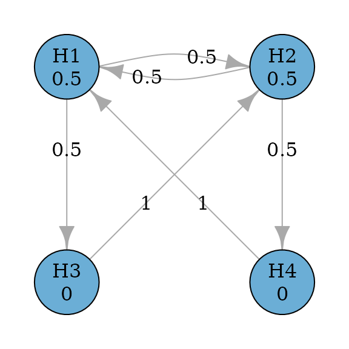

# Sequentially rejective graphical multiple comparison procedures based on Bonferroni tests

``` r

library(gt)
library(graphicalMCP)
```

## Motivating example

Consider a confirmatory clinical trial comparing a test treatment
(treatment) against the control treatment (control) for a disease. There
are two doses of treatment: the low dose and the high dose. There are
two endpoints included in the multiplicity adjustment strategy, which
are the primary endpoint (PE) and the secondary endpoint (SE). In total,
there are four null hypotheses: $`H_1`$ and $`H_3`$ are the primary and
the secondary hypotheses respectively for the low dose versus control;
$`H_2`$ and $`H_4`$ are the primary and the secondary hypotheses
respectively for the high dose versus control.

There are clinical considerations which constrain the structure of
multiple comparison procedures, and which can be flexibly incorporated
using graphical approaches. First, the low and the high doses are
considered equally important, which means that rejecting the primary
hypothesis for either dose versus control leads to a successful trial.
Regarding secondary hypotheses, each one is tested only if its
corresponding primary hypothesis has been rejected. This means that
$`H_3`$ is tested only after $`H_1`$ has been rejected; $`H_4`$ is
tested only after $`H_2`$ has been rejected.

In addition, there are some statistical considerations to complete the
graph. The primary hypotheses $`H_1`$ and $`H_2`$ will have an equal
hypothesis weight of 0.5. The secondary hypotheses will have a
hypothesis weight of 0. When a primary hypothesis has been rejected, its
weight will be propagated along two outgoing edges: One to the other
primary hypothesis and one to its descendant secondary hypothesis. The
two edges will have an equal transition weight of 0.5. When both the
primary and the secondary hypotheses have been rejected for a
dose-control comparison, their hypothesis weights will be propagated to
the primary hypothesis for the other dose-control comparison. With these
specifications, we can create the following graph.

## Create the graph

``` r

hypotheses <- c(0.5, 0.5, 0, 0)
transitions <- rbind(
  c(0, 0.5, 0.5, 0),
  c(0.5, 0, 0, 0.5),
  c(0, 1, 0, 0),
  c(1, 0, 0, 0)
)
hyp_names <- c("H1", "H2", "H3", "H4")

g <- graph_create(hypotheses, transitions, hyp_names)
```

``` r

plot(g, vertex.size = 60)
```



## Perform the graphical multiple comparison procedure

### Adjusted p-values and rejections

Given a set of p-values for $`H_1, \ldots, H_4`$, the graphical multiple
comparison procedure can be performed to control the familywise error
rate (FWER) at the significance level `alpha`. The `graph_test_shortcut`
function is agnostic to one-sided or two-sided tests. For one-sided
p-values, `alpha` is often set to 0.025 (default); for two-sided
p-values, `alpha` is often set to 0.05. We consider one-sided tests
here. A hypothesis is rejected if its adjusted p-value is less than or
equal to `alpha`. After running the procedure, hypotheses $`H_1`$,
$`H_2`$, and $`H_4`$ are rejected with their adjusted p-value
calculated.

``` r

p_values <- c(0.018, 0.01, 0.105, 0.006)
test_results <- graph_test_shortcut(g, p = p_values, alpha = 0.025)

test_results$outputs$adjusted_p # Adjusted p-values
#>    H1    H2    H3    H4 
#> 0.024 0.020 0.105 0.024
test_results$outputs$rejected # Rejections
#>    H1    H2    H3    H4 
#>  TRUE  TRUE FALSE  TRUE
```

### Obtain final and intermediate graphs after rejections

The final graph is the graph after removing rejected hypotheses $`H_1`$,
$`H_2`$, and $`H_4`$. It can be obtained via
`test_results$outputs$graph`. Rejected hypotheses get a hypothesis
weight of `NA` and a transition weight of `NA`. This is based on the
printing method of `print.updated_graph`. We can also obtain the non-NA
graph by calling hypothesis weights and transition weights separately
via `test_results$outputs$graph$hypotheses` and
`test_results$outputs$graph$transitions`. Note in this case, rejected
hypotheses get a 0 hypothesis weight and a 0 transition weight. This is
mainly for internal calculation and updating of graphs.

If we are also interested in intermediate graphs - for example, the
graph after $`H_2`$ and $`H_1`$ are rejected - we can specify
`verbose = TRUE` in `graph_test_shortcut`. Note that intermediate graphs
depend on the order of rejections, i.e., the sequence of hypotheses
being rejected. The default order is defined by the increasing adjusted
p-values, followed by the earlier hypothesis numbering in the case of
ties. In this example, the default order of rejection is
$`H_2\rightarrow H_1\rightarrow H_4`$. To obtain intermediate graphs
based on this order of rejection, one can specify
`test_results_verbose$details$results`. For example, the graph after
$`H_2`$ and $`H_1`$ being rejected is given by
`test_results_verbose$details$results[[3]]`.

``` r

test_results$outputs$graph # Final graph after H1, H2 and H4 rejected (as NA's)
#> Updated graph
#> 
#> --- Hypothesis weights ---
#> H1: NA
#> H2: NA
#> H3:  1
#> H4: NA
#> 
#> --- Transition weights ---
#>     H1 H2 H3 H4
#>  H1 NA NA NA NA
#>  H2 NA NA NA NA
#>  H3 NA NA  0 NA
#>  H4 NA NA NA NA
test_results$outputs$graph$hypotheses # Hypothesis weights of the final graph
#> H1 H2 H3 H4 
#>  0  0  1  0
test_results$outputs$graph$transitions # Transition weights of the final graph
#>    H1 H2 H3 H4
#> H1  0  0  0  0
#> H2  0  0  0  0
#> H3  0  0  0  0
#> H4  0  0  0  0

test_results_verbose <- graph_test_shortcut(
  g,
  p = p_values,
  alpha = 0.025,
  verbose = TRUE
)

# Intermediate graph after H1 and H2 rejected
test_results_verbose$details$results[[3]]
#> Updated graph
#> 
#> --- Hypothesis weights ---
#> H1:  NA
#> H2:  NA
#> H3: 0.5
#> H4: 0.5
#> 
#> --- Transition weights ---
#>     H1 H2 H3 H4
#>  H1 NA NA NA NA
#>  H2 NA NA NA NA
#>  H3 NA NA  0  1
#>  H4 NA NA  1  0
```

### Obtain possible orders of rejections

The order of rejections may not be unique and not all orders are valid.
For this example, the rejected hypotheses are $`H_1`$, $`H_2`$ and
$`H_4`$. The default order of rejections is
$`H_2 \rightarrow H_1 \rightarrow H_4`$. Another valid order of
rejections is $`H_2 \rightarrow H_4 \rightarrow H_1`$. However, the
first rejected hypothesis can not be $`H_1`$ or $`H_4`$. To obtain all
possible rejection orders, one can use the function
`graph_rejection_orderings`. Then intermediate and final graphs can be
obtained by using the function `graph_update` with a particular order of
rejections.

``` r

# Obtain all valid orders of rejections
orders <- graph_rejection_orderings(test_results)$valid_orderings
orders
#> [[1]]
#> H2 H1 H4 
#>  2  1  4 
#> 
#> [[2]]
#> H2 H4 H1 
#>  2  4  1

# Intermediate graphs following the order of H2 and H4
graph_update(g, delete = orders[[2]])$intermediate_graphs[[3]]
#> Updated graph
#> 
#> --- Hypothesis weights ---
#> H1:  1
#> H2: NA
#> H3:  0
#> H4: NA
#> 
#> --- Transition weights ---
#>     H1 H2 H3 H4
#>  H1  0 NA  1 NA
#>  H2 NA NA NA NA
#>  H3  1 NA  0 NA
#>  H4 NA NA NA NA
```

### Obtain adjusted significance levels

An equivalent way to obtain rejections is by adjusting significance
levels. A hypothesis is rejected if its p-value is less than or equal to
its adjusted significance level. The adjusted significance levels are
calculated in the same order as adjusted p-values:
$`H_2 \rightarrow H_1 \rightarrow H_4`$, and there are four steps of
checking for rejections. First, $`H_2`$ is rejected at an adjusted
significance level of `0.5 * alpha`. Second, $`H_1`$ is rejected at an
adjusted significance level of `0.75 * alpha`, after $`H_2`$ is
rejected. Third, $`H_4`$ is rejected at an adjusted significance level
of `0.5 * alpha`, after $`H_1`$ and $`H_2`$ are rejected. Fourth and
finally, $`H_3`$ cannot be rejected at an adjusted significance level of
`alpha`, after $`H_1`$, $`H_2`$ and $`H_4`$ are rejected. These results
can be obtained by specifying `test_values = TRUE`.

``` r

test_results_test_values <- graph_test_shortcut(
  g,
  p = p_values,
  alpha = 0.025,
  test_values = TRUE
)

test_results_test_values$test_values$results
#>   Step Hypothesis     p Weight Alpha Inequality_holds
#> 1    1         H2 0.010   0.50 0.025             TRUE
#> 2    2         H1 0.018   0.75 0.025             TRUE
#> 3    3         H4 0.006   0.50 0.025             TRUE
#> 4    4         H3 0.105   1.00 0.025            FALSE
```

## Power simulation

Given the above graph, we are interested in the “power” of the trial.
For a single null hypothesis, the power is the probability of a true
positive - that is, rejecting the null hypothesis at the significance
level `alpha` when the alternative hypothesis is true. For multiple null
hypotheses, there could be multiple versions of “power”. For example,
the power to reject at least one hypothesis vs the power to reject all
hypotheses, given the alternative hypotheses are true. With the
graphical multiple comparison procedures, it is also important to
understand the power to reject each hypothesis, given the multiplicity
adjustment. Sometimes, we may want to customize definitions of power to
define success. Thus power calculation is an important aspect of trial
design.

### Input: Marginal power for primary hypotheses

Assume that the primary endpoint is about the occurrence of an
unfavorable clinical event. To evaluate the treatment effect, the
proportion of patients with this event is calculated, and a lower
proportion is preferred. Assume that the proportions are 0.181 for the
low and the high doses, and 0.3 for control. Using the equal
randomization among the three treatment groups, the clinical trial team
chooses a total sample size of 600 with 200 per group. This leads to a
marginal power of 80% for $`H_1`$ and $`H_2`$, respectively, using the
two-sample test for difference in proportions with unpooled variance
each at one-sided significance level 0.025. In this calculation, we use
the marginal power to combine the information from the treatment effect,
any nuisance parameter, and sample sizes for each hypothesis. Note that
the significance level used for the marginal power calculation must be
the same as `alpha`, which is used as the significance level for the
FWER control. In addition, the marginal power has a one-to-one
relationship with the noncentrality parameter, which is illustrated
below.

``` r

alpha <- 0.025
prop <- c(0.3, 0.181, 0.181)
sample_size <- rep(200, 3)

unpooled_variance <-
  prop[-1] * (1 - prop[-1]) / sample_size[-1] +
  prop[1] * (1 - prop[1]) / sample_size[1]

noncentrality_parameter_primary <-
  -(prop[-1] - prop[1]) / sqrt(unpooled_variance)

power_marginal_primary <- pnorm(
  qnorm(alpha, lower.tail = FALSE),
  mean = noncentrality_parameter_primary,
  sd = 1,
  lower.tail = FALSE
)

names(power_marginal_primary) <- c("H1", "H2")
power_marginal_primary
#>        H1        H2 
#> 0.8028315 0.8028315
```

### Input: Marginal power for secondary hypotheses

Assume that the secondary endpoint is about the change in total
medication score from baseline, which is a continuous outcome. To
evaluate the treatment effect, the mean change is calculated, and
greater reduction is preferred. Assume that the mean change from
baseline is the reduction of 7.5 and 8.25, respectively for the low and
the high doses, and 5 for control. Further assume a known common
standard deviation of 10. Given the sample size of 200 per treatment
group, the marginal power is 71% and 90% for $`H_3`$ and $`H_4`$,
respectively, using the two-sample $`z`$-test for the difference in
means each at the one-sided significance level 0.025.

``` r

mean_change <- c(5, 7.5, 8.25)
sd <- rep(10, 3)
variance <- sd[-1]^2 / sample_size[-1] + sd[1]^2 / sample_size[1]

noncentrality_parameter_secondary <-
  (mean_change[-1] - mean_change[1]) / sqrt(variance)

power_marginal_secondary <- pnorm(
  qnorm(alpha, lower.tail = FALSE),
  mean = noncentrality_parameter_secondary,
  sd = 1,
  lower.tail = FALSE
)

names(power_marginal_secondary) <- c("H3", "H4")
power_marginal_secondary
#>        H3        H4 
#> 0.7054139 0.9014809
```

### Input: Correlation structure to simulate test statistics

In addition to the marginal power, we also need to make assumptions
about the joint distribution of test statistics. In this example, we
assume that they follow a multivariate normal distribution with means
defined by the noncentrality parameters above and the correlation matrix
$`R`$. To obtain the correlations, it is helpful to understand that
there are two types of correlations in this example. The correlation
between two dose-control comparisons for the same endpoint and the
correlation between endpoints. The former correlation can be calculated
as a function of sample size. For example, the correlation between test
statistics for $`H_1`$ and $`H_2`$ is
$`\rho_{12}=\left(\frac{n_1}{n_1+n_0}\right)^{1/2}\left(\frac{n_2}{n_3+n_0}\right)^{1/2}`$.
Under the equal randomization, this correlation is 0.5. The correlation
between test statistics for $`H_3`$ and $`H_4`$ is the same as the
above. On the other hand, the correlation between endpoints for the same
dose-control comparison is often estimated based on prior knowledge or
from previous trials. Without the information, we assume it to be
$`\rho_{13}=\rho_{24}=0.5`$. In practice, one could set this correlation
as a parameter and try multiple values to assess the sensitivity of this
assumption. Regarding the correlation between test statistics for
$`H_1`$ and $`H_4`$ and for $`H_2`$ and $`H_3`$, they are even more
difficult to estimate. Here we use a simple product rule, which means
that this correlation is a product of correlations of the two previously
assumed correlations. For example, $`\rho_{14}=\rho_{12}*\rho_{24}`$ and
$`\rho_{23}=\rho_{12}*\rho_{13}`$. In practice, one may make further
assumptions instead of using the product rule.

``` r

corr <- matrix(0, nrow = 4, ncol = 4)

corr[1, 2] <-
  corr[3, 4] <-
  sqrt(
    sample_size[2] / sum(sample_size[1:2]) *
      sample_size[3] / sum(sample_size[c(1, 3)])
  )

rho <- 0.5
corr[1, 3] <- corr[2, 4] <- rho
corr[1, 4] <- corr[2, 3] <- corr[1, 2] * rho
corr <- corr + t(corr)
diag(corr) <- 1
colnames(corr) <- hyp_names
rownames(corr) <- hyp_names
corr
#>      H1   H2   H3   H4
#> H1 1.00 0.50 0.50 0.25
#> H2 0.50 1.00 0.25 0.50
#> H3 0.50 0.25 1.00 0.50
#> H4 0.25 0.50 0.50 1.00
```

### User-defined success criteria

As mentioned earlier, there are multiple versions of “power” when there
are multiple hypotheses. Commonly used “power” definitions include:

- Local power: The probability of each hypothesis being rejected (with
  multiplicity adjustment)
- Expected no. of rejections: The expected number of rejections
- Power to reject 1 or more: The probability to reject at least one
  hypothesis
- Power to reject all: The probability to reject all hypotheses

These are the default outputs from the `graph_calculate_power` function.
In addition, a user can customize success criteria to define other
versions of “power”.

``` r

success_fns <- list(
  # Probability to reject H1
  H1 = function(x) x[1],

  # Expected number of rejections
  `Expected no. of rejections` = function(x) x[1] + x[2] + x[3] + x[4],

  # Probability to reject at least one hypothesis
  `AtLeast1` = function(x) x[1] | x[2] | x[3] | x[4],

  # Probability to reject all hypotheses
  `All` = function(x) x[1] & x[2] & x[3] & x[4],

  # Probability to reject both H1 and H2
  `H1andH2` = function(x) x[1] & x[2],

  # Probability to reject both hypotheses for the low dose or the high dose
  `(H1andH3)or(H2andH4)` = function(x) (x[1] & x[3]) | (x[2] & x[4])
)
```

### Output: Simulate power

Given the above inputs, we can estimate “power” via simulation for the
graphical multiple comparison procedure at one-sided significance level
`alpha = 0.025` using `sim_n = 1e5` simulations and the random seed
1234. The local power is 0.758, 0.765, 0.689, and 0.570, respectively
for $`H_1, \ldots, H_4`$. Note that the local power is lower than the
marginal power because the former is adjusted for multiplicity. The
power to reject at least one hypothesis is 0.856 and the power to reject
all hypotheses is 0.512. The expected number of rejections is 2.782. For
the last two user-defined success criteria, the probability to reject
both $`H_1`$ and $`H_2`$ is 0.667, and the probability to reject at
least one pair of $`(H_1`$ and $`H_3)`$ and $`(H_2`$ and $`H_4)`$ is
0.747.

``` r

set.seed(1234)
power_output <- graph_calculate_power(
  g,
  alpha = 0.025,
  sim_corr = corr,
  sim_n = 1e5,
  power_marginal = c(power_marginal_primary, power_marginal_secondary),
  sim_success = success_fns
)

power_output$power
#> $power_local
#>      H1      H2      H3      H4 
#> 0.76396 0.75887 0.56767 0.69133 
#> 
#> $rejection_expected
#> [1] 2.78183
#> 
#> $power_at_least_1
#> [1] 0.85557
#> 
#> $power_all
#> [1] 0.51205
#> 
#> $power_success
#>                         H1 Expected no. of rejections 
#>                    0.76396                    2.78183 
#>                   AtLeast1                        All 
#>                    0.85557                    0.51205 
#>                    H1andH2       (H1andH3)or(H2andH4) 
#>                    0.66726                    0.74695
```

To see the detailed outputs of all simulated p-values and rejection
decisions for all hypotheses, specify `verbose = TRUE`. This will
produce a lot of outputs. To allow flexible printing functions, a user
can change the following:

- The indented space with the default setting of `indent = 2`
- The precision of numeric values (i.e., the number of significant
  digits) with the default setting of `precision = 4`

``` r

set.seed(1234)
power_verbose_output <- graph_calculate_power(
  g,
  alpha = 0.025,
  sim_corr = corr,
  sim_n = 1e5,
  power_marginal = c(power_marginal_primary, power_marginal_secondary),
  sim_success = success_fns,
  verbose = TRUE
)

head(power_verbose_output$details$p_sim, 10)
#>                 H1           H2           H3           H4
#>  [1,] 0.0308204265 0.0120653993 0.0041185823 9.324338e-02
#>  [2,] 0.0007933716 0.0006499046 0.0245177515 2.965604e-03
#>  [3,] 0.0302991819 0.0595395828 0.0543082956 2.625834e-02
#>  [4,] 0.0097433244 0.0033185711 0.0007417213 4.024688e-04
#>  [5,] 0.0197134942 0.0086161835 0.0164182765 2.418325e-07
#>  [6,] 0.0031206572 0.0067023099 0.0137441457 2.751703e-04
#>  [7,] 0.0302208038 0.1423757994 0.0060382838 2.117403e-02
#>  [8,] 0.0024975725 0.0294025573 0.0004142729 2.207786e-03
#>  [9,] 0.0618994292 0.0387257108 0.3166125781 5.699791e-02
#> [10,] 0.3677921053 0.1895975134 0.0702264885 1.189651e-02

print(power_verbose_output, indent = 4, precision = 6)
#> 
#> Test parameters ($inputs) ------------------------------------------------------
#>     Initial graph
#> 
#>     --- Hypothesis weights ---
#>     H1: 0.5
#>     H2: 0.5
#>     H3: 0.0
#>     H4: 0.0
#> 
#>     --- Transition weights ---
#>         H1  H2  H3  H4
#>     H1 0.0 0.5 0.5 0.0
#>     H2 0.5 0.0 0.0 0.5
#>     H3 0.0 1.0 0.0 0.0
#>     H4 1.0 0.0 0.0 0.0
#> 
#>     Alpha = 0.025
#> 
#>     Test types
#>     bonferroni: (H1, H2, H3, H4)
#> 
#> Simulation parameters ($inputs) ------------------------------------------------
#>     Testing 100,000 simulations with multivariate normal params:
#> 
#>                           H1       H2       H3       H4
#>     Marginal power: 0.802831 0.802831 0.705414 0.901481
#> 
#>     Correlation:      H1   H2   H3   H4
#>                  H1 1.00 0.50 0.50 0.25
#>                  H2 0.50 1.00 0.25 0.50
#>                  H3 0.50 0.25 1.00 0.50
#>                  H4 0.25 0.50 0.50 1.00
#> 
#> Power calculation ($power) -----------------------------------------------------
#>                                      H1      H2      H3      H4
#>                    Local power: 0.76396 0.75887 0.56767 0.69133
#> 
#>     Expected no. of rejections: 2.78183
#>      Power to reject 1 or more: 0.85557
#>            Power to reject all: 0.51205
#> 
#>                Success measure   Power
#>                             H1 0.76396
#>     Expected no. of rejections 2.78183
#>                       AtLeast1 0.85557
#>                            All 0.51205
#>                        H1andH2 0.66726
#>           (H1andH3)or(H2andH4) 0.74695
#> 
#> Simulation details ($details) --------------------------------------------------
#>         p_sim_H1    p_sim_H2    p_sim_H3    p_sim_H4 rej_H1 rej_H2 rej_H3 rej_H4
#>      3.08204e-02 1.20654e-02 4.11858e-03 9.32434e-02  FALSE   TRUE  FALSE  FALSE
#>      7.93372e-04 6.49905e-04 2.45178e-02 2.96560e-03   TRUE   TRUE   TRUE   TRUE
#>      3.02992e-02 5.95396e-02 5.43083e-02 2.62583e-02  FALSE  FALSE  FALSE  FALSE
#>      9.74332e-03 3.31857e-03 7.41721e-04 4.02469e-04   TRUE   TRUE   TRUE   TRUE
#>      1.97135e-02 8.61618e-03 1.64183e-02 2.41833e-07   TRUE   TRUE   TRUE   TRUE
#>      3.12066e-03 6.70231e-03 1.37441e-02 2.75170e-04   TRUE   TRUE   TRUE   TRUE
#>      3.02208e-02 1.42376e-01 6.03828e-03 2.11740e-02  FALSE  FALSE  FALSE  FALSE
#>      2.49757e-03 2.94026e-02 4.14273e-04 2.20779e-03   TRUE  FALSE   TRUE  FALSE
#>      6.18994e-02 3.87257e-02 3.16613e-01 5.69979e-02  FALSE  FALSE  FALSE  FALSE
#>      3.67792e-01 1.89598e-01 7.02265e-02 1.18965e-02  FALSE  FALSE  FALSE  FALSE
#>     ... (Use `print(x, rows = <nn>)` for more)
```

## Reference

Bretz, Frank, Willi Maurer, Werner Branath, and Martin Posch. 2009. “A
Graphical Approach to Sequentially Rejective Multiple Test Procedures.”
*Statistics in Medicine* 53 (4): 586–604.
<https://doi.org/10.1002/sim.3495>.

Bretz, Frank, Willi Maurer, and Gerhard Hommel. 2011. “Test and Power
Considerations for Multiple Endpoint Analyses Using Sequentially
Rejective Graphical Procedures.” *Statistics in Medicine* 30 (13):
1489–501. <https://doi.org/10.1002/sim.3988>.
